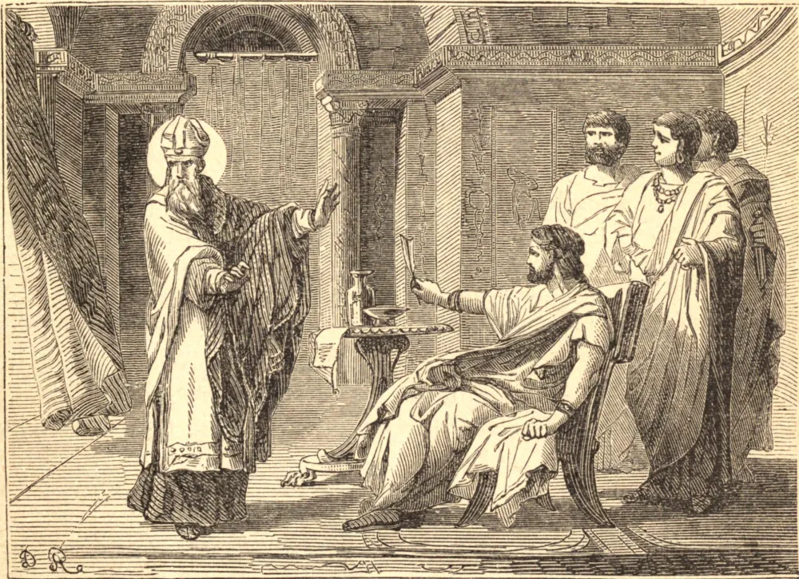

# 25 de fevereiro — SÃO TARÁSIO

TARÁSIO nasceu em Constantinopla por volta de meados do século oitavo, de família nobre. Sua mãe Eucrácia educou-o na prática das mais eminentes virtudes. Por seus talentos e virtude ganhou a estima de todos, e foi elevado às maiores honras do império, sendo feito cônsul, e depois primeiro secretário de estado do Imperador Constantino e da Imperatriz Irene, sua mãe. No meio da corte, e em suas mais altas honras, levava uma vida como a de um religioso.

Paulo, Patriarca de Constantinopla, o terceiro daquele nome, embora se houvesse conformado em alguns aspectos com a heresia então reinante, possuía várias boas qualidades, e não só era amado pelo povo por sua caridade para com os pobres, mas altamente estimado por toda a corte por sua grande prudência. Tocado pelo remorso, abandonou a sé patriarcal, e vestiu o hábito religioso no mosteiro de Floro em Constantinopla.

Tarásio foi escolhido para sucedê-lo pelo consentimento unânime da corte, do clero e do povo. Achando inútil opor-se à sua eleição, declarou que não podia em consciência aceitar o governo de uma sé que havia sido cortada da comunhão católica, exceto sob a condição de que um concílio geral fosse convocado para resolver as disputas que dividiam a Igreja naquele tempo a respeito das santas imagens. Tendo sido isto acordado, foi solenemente declarado patriarca, e consagrado pouco depois, no Dia de Natal. O concílio foi aberto no dia 1 de agosto, na Igreja dos Apóstolos em Constantinopla, em 786; mas, sendo perturbado pelas violências dos Iconoclastas, foi suspenso, e reuniu-se de novo no ano seguinte na Igreja de Santa Sofia em Niceia. O concílio, havendo declarado o sentido da Igreja em relação à matéria em debate, que foi reconhecido ser a concessão às santas pinturas e imagens de uma honra relativa, foi encerrado com as habituais aclamações e orações pela prosperidade do imperador e da imperatriz; após o que, cartas sinodais foram enviadas a todas as igrejas, e em particular ao Papa, que aprovou o concílio.

A vida deste santo patriarca foi um modelo de perfeição para seu clero e seu povo. Sua mesa continha apenas o necessário à vida; concedia a si mesmo muito pouco tempo para o sono, sendo sempre o primeiro a levantar-se e o último a deitar-se em sua casa. A leitura e a oração preenchiam todas as suas horas de lazer.

O imperador, havendo-se enamorado de Teodota, dama de honra de sua esposa, a Imperatriz Maria, estava resolvido a repudiar esta última. Empregou todos os seus esforços para conquistar o patriarca aos seus desejos, mas São Tarásio recusou-se resolutamente a sancionar a iniquidade. O santo homem entregou sua alma a Deus em paz no dia 25 de fevereiro de 806, depois de haver ocupado a sé vinte e um anos e dois meses.

**Reflexão**—O mais alto louvor que a Escritura pronuncia sobre o santo homem Jó está contido nestas palavras: "Era simples e reto."
