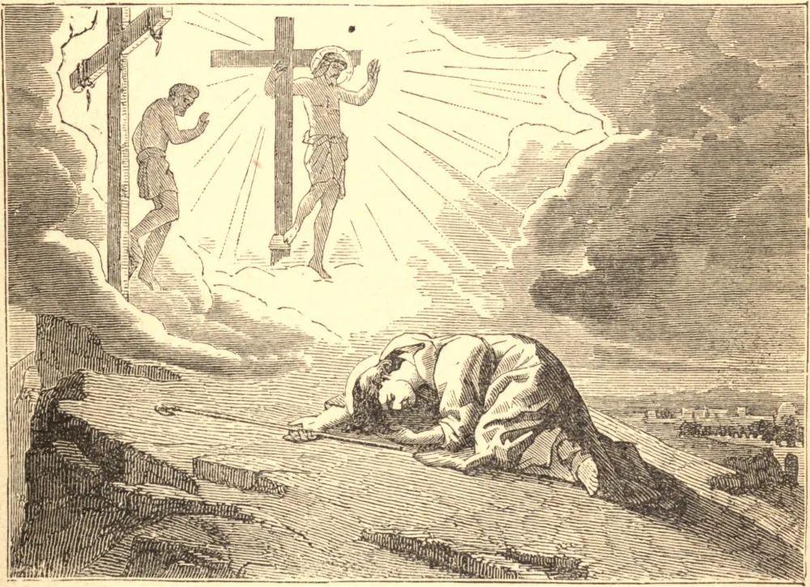

# 26 de fevereiro — SÃO PORFÍRIO, Bispo

AOS vinte e cinco anos de idade, Porfírio, rico cidadão de Tessalônica, deixou o mundo por uma das grandes casas religiosas no deserto de Cete. Ali permaneceu cinco anos, e então, achando-se atraído a uma vida mais solitária, passou à Palestina, onde passou um período semelhante na mais severa penitência, até que a má saúde o obrigou a moderar suas austeridades. Fez então seu lar em Jerusalém, e a despeito de seus padecimentos visitava os Lugares Santos todos os dias; pensando, diz seu biógrafo, tão pouco em sua enfermidade que parecia estar afligido em outro corpo, e não no seu próprio.

Por esse tempo Deus pôs em seu coração que vendesse tudo o que tinha e desse aos pobres, e então, em recompensa do sacrifício, restituiu-lhe por um milagre a perfeita saúde. Em 393 foi ordenado sacerdote e encarregado do cuidado das relíquias da verdadeira cruz; três anos depois, a despeito de toda a resistência que sua humildade pôde oferecer, foi consagrado Bispo de Gaza. Aquela cidade era um foco de paganismo, e Porfírio encontrou nela amplo campo para seu zelo apostólico. Seus labores e os milagres que os acompanhavam efetuaram a conversão de muitos; e um édito imperial para a destruição dos templos pagãos, obtido por influência de São João Crisóstomo, fortaleceu grandemente suas mãos.

Quando São Porfírio chegou primeiro a Gaza, encontrou ali um templo mais esplêndido que os demais, em honra do deus principal. Quando saiu o édito para destruir todos os vestígios do culto pagão, São Porfírio decidiu envergonhar Satanás de modo especial onde ele havia recebido honra especial. Uma igreja cristã foi edificada sobre o local, e seu acesso foi pavimentado com os mármores do templo pagão. Assim, todo adorador de Jesus Cristo pisava sob os pés as relíquias da idolatria e da superstição cada vez que ia assistir à santa Missa. Viveu para ver sua diocese em grande parte livre da idolatria, e morreu em 420.

**Reflexão**—Toda indagação supersticiosa de coisas ocultas é proibida pelo Primeiro Mandamento igualmente com o culto de qualquer falso deus. Peçamos a São Porfírio um grande zelo em guardar este mandamento, para que não sejamos desviados, como tantos o são, por uma mente curiosa e indiscreta.
