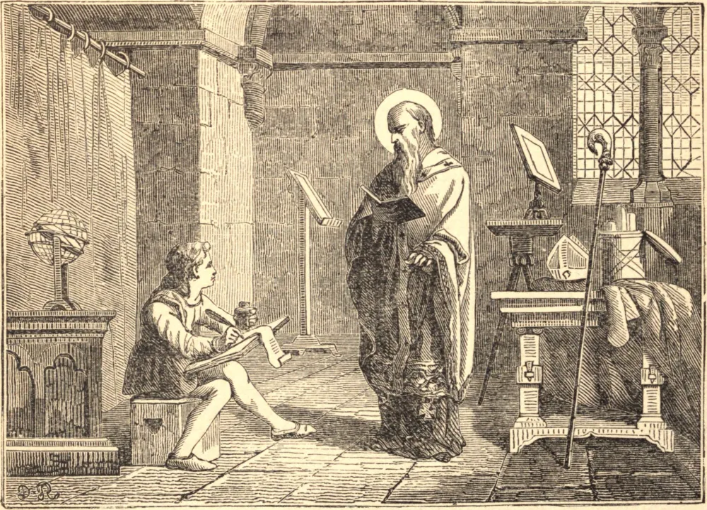

# 27 de fevereiro — SÃO LEANDRO, Bispo

SÃO LEANDRO nasceu de uma ilustre família em Cartagena, na Espanha. Era o mais velho de cinco irmãos, vários dos quais são contados entre os Santos. Entrou num mosteiro muito jovem, onde viveu muitos anos e atingiu um grau eminente de virtude e de sagrada ciência. Estas qualidades ocasionaram sua promoção à sé de Sevilha; mas sua mudança de condição fez pouca ou nenhuma alteração em seu método de vida, embora lhe trouxesse grande acréscimo de cuidado e solicitude. A Espanha estava naquele tempo em poder dos visigodos. Estes godos, estando infectados pelo arianismo, estabeleciam esta heresia por onde quer que chegassem; de modo que, quando São Leandro foi feito bispo, ela reinava na Espanha havia cem anos. Esta era sua grande aflição; contudo, por suas orações a Deus, e por seus mais zelosos e incansáveis esforços, tornou-se o feliz instrumento da conversão daquela nação à fé católica. Havendo convertido, entre outros, Hermenegildo, filho mais velho e herdeiro presuntivo do rei, Leandro foi banido pelo Rei Leovigildo. Este piedoso príncipe foi morto por seu desnaturado pai, no ano seguinte, por recusar-se a receber a Comunhão das mãos de um bispo ariano. Mas, tocado pelo remorso não muito depois, o rei chamou de volta nosso Santo; e, caindo enfermo e achando-se sem esperanças de recuperação, mandou chamar São Leandro, e recomendou-lhe seu filho Recaredo. Este filho, dando ouvidos a São Leandro, logo se tornou católico, e por fim converteu toda a nação dos visigodos. Não foi menos bem-sucedido a respeito dos suevos, um povo da Espanha, que seu pai Leovigildo havia pervertido.

São Leandro não foi menos zeloso na reforma dos costumes do que em restaurar a pureza da fé; e plantou as sementes daquele zelo e fervor que depois produziram tantos mártires e Santos. Este santo doutor da Espanha morreu por volta do ano 596, no dia 27 de fevereiro, como prova Mabillon a partir de seu epitáfio. A Igreja de Sevilha tem sido uma sé metropolitana desde o terceiro século. A catedral é a mais magnífica, tanto quanto à estrutura como ao ornamento, de toda a Espanha.
