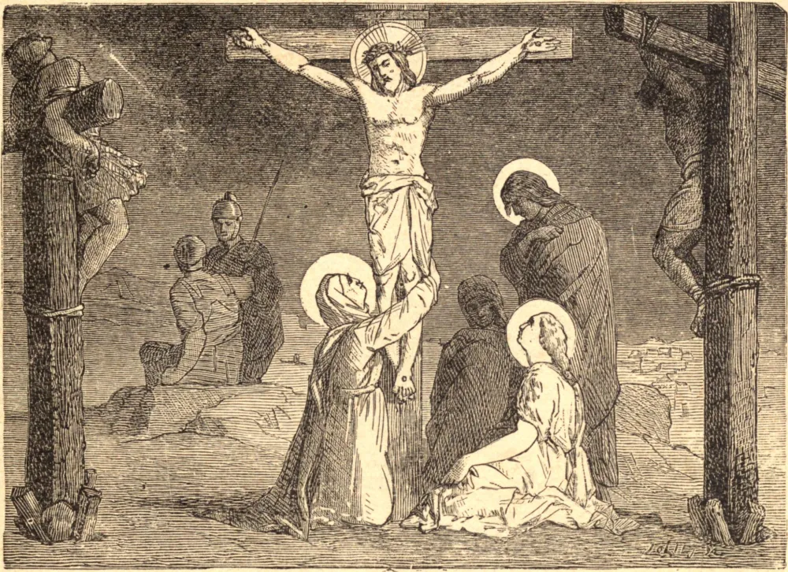

# Sexta-feira Santa

Jesus Cristo foi pregado na cruz por volta do meio-dia, nela expirou de tarde, e foi dela descido ao entardecer, próximo do pôr do sol, ou da hora sexta. Segundo a linguagem de São Paulo, assim Ele, por seu sangue, pacificou o céu e a terra. Se esta forma de expressão não transmite simplesmente a reconciliação do céu com a terra, ela vela um mistério impenetrável à débil razão. Mas esta mesma reconciliação é em si o maior mistério; pois o homem sempre em vão tenta explicá-la recorrendo a comparações e considerações de mera concepção humana, as quais são vastamente insuficientes, pelo fato mesmo de serem humanas. E que importa, afinal, que compreendamos ou não tão grande mistério? Basta-nos que ele produziu o seu efeito, e que somos capazes de adorá-lo com gratidão e amor.

Que a filosofia escarneça daquilo que não sonda é pura insensatez. A incredulidade pode zombar daquilo que não reconhece; cabe-lhe, contudo, saber se a razão está do seu lado. Que a heresia explique, à maneira humana, as coisas divinas; quanto a nós, cristãos, fixemos o nosso olhar no Mediador entre Deus e o homem, erguido ao alto entre o céu e a terra, com os braços estendidos para abarcar o universo; com a cabeça inclinada, para dar ao mundo o ósculo de paz e reconciliação, depois de haver, ao custo de seu sangue, comprado a paz, e humilhemos todo o nosso ser em sincera ação de graças e amor.

Imprimamos reverentemente nossos lábios nesta cruz, instrumento de nossa salvação; inclinemo-nos trêmulos diante do Deus justo, que tira tão nobre vingança de nossa culpa. Por nossas obras façamos algum retorno pelo preço que custamos; por nossa penitência e lágrimas apliquemos a nós mesmos o mérito de sua redenção, e doravante vivamos só para o céu, visto que fomos feitos herdeiros do céu.

**Reflexão**—A cruz, "para os judeus, na verdade, escândalo, e para os gentios, loucura", é, apesar de tudo, o instrumento do poder de Cristo e da sabedoria de Deus.
