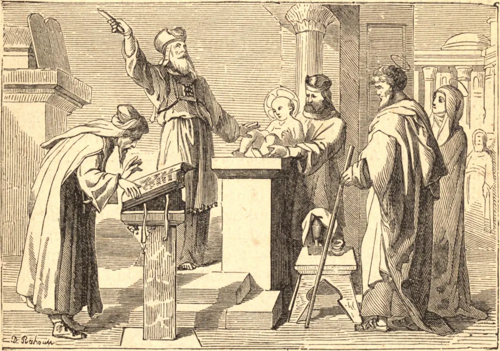

# 1 de janeiro — A CIRCUNCISÃO DE NOSSO SENHOR

A CIRCUNCISÃO era um sacramento da Antiga Lei, e a primeira observância legal exigida por Deus Todo-Poderoso dos descendentes de Abraão. Era um sacramento de iniciação no serviço de Deus, e uma promessa e compromisso de crer e agir conforme Ele havia revelado e ordenado. A lei da circuncisão permaneceu em vigor até a morte de Cristo, e, tendo Nosso Salvador nascido sob a lei, *convinha-Lhe*, a Ele que veio ensinar à humanidade a obediência à lei de Deus, *cumprir toda a justiça*, e submeter-se a ela. Por isso foi circuncidado, para que pudesse *remir aqueles que estavam sob a lei*, libertando-os de sua servidão; e para que aqueles que antes estavam na condição de servos fossem postos em liberdade, e *recebessem a adoção de filhos* no Batismo, que, por instituição de Cristo, sucedeu à circuncisão. No dia em que o divino Infante foi circuncidado, recebeu o nome de Jesus, que significa SALVADOR, o qual lhe havia sido dado pelo anjo antes de ser concebido. Esse nome, tão belo, tão glorioso, o divino Menino não quer levar um só momento sem cumprir o seu significado; mesmo no momento de Sua circuncisão Ele se mostrou um SALVADOR, derramando por nós aquele sangue do qual uma só gota é mais que suficiente para o resgate e a salvação do mundo inteiro.

## Reflexão

Aproveitemos a circunstância do ano novo, e da maravilhosa renovação operada no mundo pelo grande mistério deste dia, para renovar em nossos corações um acréscimo de fervor e de generosidade no serviço de Deus. Seja este ano um ano de fervor e de progresso! Ele passará rapidamente, como aquele que acaba de findar. Se Deus nos permitir ver o seu fim, quão contentes e felizes ficaremos por tê-lo passado santamente!
