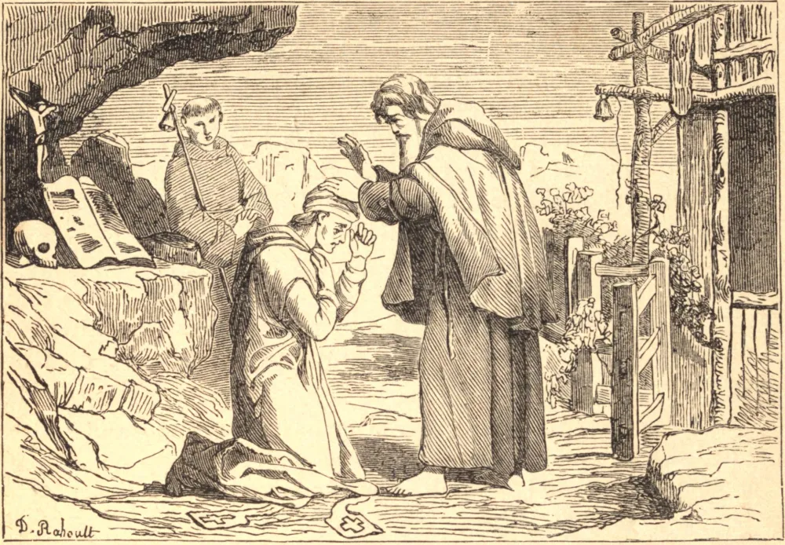

# SÃO MACÁRIO DE ALEXANDRIA

MACÁRIO, quando jovem, deixou sua banca de frutas em Alexandria para unir-se ao grande Santo Antão. O patriarca, advertido por um milagre da santidade de seu discípulo, nomeou-o o herdeiro de suas virtudes. Sua vida foi um longo combate contra si mesmo. "Estou atormentando o meu atormentador", respondeu ele a um que o encontrou curvado sob um cesto de areia no calor do dia. "Sempre que me torno preguiçoso e ocioso, sou importunado por desejos de viagens distantes." Quando estava de todo exausto, voltava à sua cela. Como o sono às vezes o vencia, fez vigília por vinte dias e noites; estando a ponto de desfalecer, entrou em sua cela e dormiu, mas dali em diante dormia apenas quando queria. Um mosquito o picou; ele o matou. Em desforra por esta moleza, permaneceu nu num pântano até que seu corpo ficou coberto de picadas nocivas e só foi reconhecido pela voz. Certa vez, estando com sede, recebeu de presente uns cachos de uvas, mas passou-os intactos a um eremita que labutava no calor. Este os deu a um terceiro, que os entregou a um quarto; assim as uvas percorreram todo o deserto e voltaram a Macário, que agradeceu a Deus pela abstinência de seus irmãos. Macário viu os demônios assaltando os eremitas em oração. Punham os dedos na boca de alguns, e os faziam bocejar. Fechavam os olhos de outros, e caminhavam sobre eles enquanto dormiam. Colocavam imagens vãs e sensuais diante de muitos dos irmãos, e depois zombavam dos que se deixavam cativar por elas. Nenhum vencia os demônios de modo eficaz senão aqueles que, por constante vigilância, os repeliam de imediato. Macário visitou um eremita diariamente por quatro meses, mas nunca pôde falar-lhe, pois ele estava sempre em oração; por isso chamou-o de "anjo na terra". Depois de muitos anos como Superior, Macário fugiu disfarçado para junto de São Pacômio, a fim de recomeçar como seu noviço; mas São Pacômio, instruído por uma visão, mandou que voltasse aos seus irmãos, que o amavam como a seu pai. Em sua velhice, julgando a natureza domada, resolveu passar cinco dias a sós em oração. No terceiro dia a cela pareceu em chamas, e Macário saiu. Deus permitiu esta ilusão, disse ele, para que não fosse enredado pelo orgulho. Aos setenta e três anos foi enviado ao exílio e brutalmente ultrajado pelos hereges arianos. Morreu no ano de 394.

## Reflexão

A oração é a respiração da alma. Mas São Macário ensina-nos que a mente e o corpo devem ser submetidos antes que a alma esteja livre para orar.
