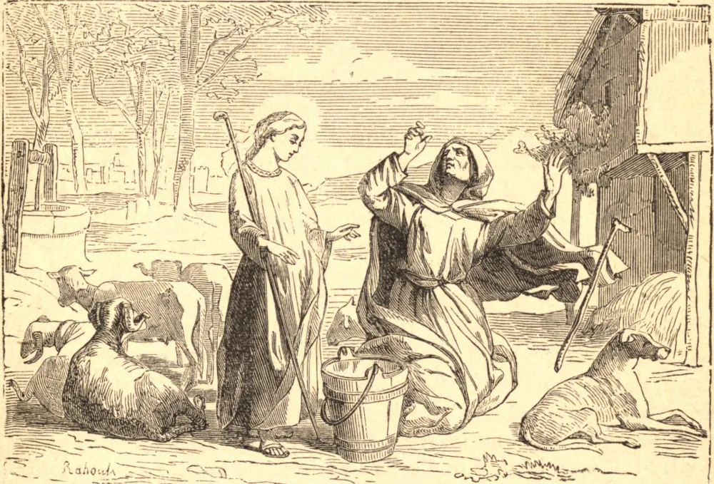

# 3 de janeiro — SANTA GENOVEVA, Virgem

GENOVEVA nasceu em Nanterre, perto de Paris. São Germano, ao passar por ali, notou de modo especial uma pequena pastora, e predisse sua futura santidade. Aos sete anos de idade fez um voto de castidade perpétua. Após a morte de seus pais, Paris tornou-se sua morada; mas ela viajava com frequência em obras de misericórdia, que, pelos dons de profecia e milagres, realizava infalivelmente. Em certa ocasião foi cruelmente perseguida: seus inimigos, invejosos de seu poder, chamaram-na de hipócrita e tentaram afogá-la; mas, tendo São Germano enviado-lhe algum pão abençoado como sinal de estima, o clamor cessou, e dali em diante ela foi sempre honrada como Santa. Durante o cerco de Paris por Childerico, rei dos francos, Genoveva saiu com alguns seguidores e conseguiu trigo para os cidadãos famintos. Não obstante, Childerico, embora pagão, respeitava-a, e a seu pedido poupou a vida de muitos prisioneiros. Por suas exortações, novamente, quando Átila e seus hunos se aproximavam da cidade, os habitantes, em vez de fugir, entregaram-se à oração e à penitência, e desviaram, como ela predissera, o flagelo iminente. Clóvis, quando convertido do paganismo por sua santa esposa, Santa Clotilde, fez de Genoveva sua conselheira constante, e, apesar de seu caráter violento, tornou-se um rei generoso e cristão. Ela morreu poucas semanas depois daquele monarca, em 512, com a idade de oitenta e nove anos.

Irrompeu uma peste em Paris em 1129, que em pouco tempo ceifou catorze mil pessoas e, apesar de todos os esforços humanos, acrescentava diariamente novas vítimas. Por fim, em 26 de novembro, o santuário de Santa Genoveva foi levado em solene procissão por toda a cidade. Naquele mesmo dia morreram apenas três pessoas, as demais recuperaram-se, e nenhuma outra adoeceu. Este foi apenas o primeiro de uma série de favores milagrosos que a cidade de Paris obteve por meio das relíquias de sua Santa padroeira.

## Reflexão

Genoveva era apenas uma pobre camponesa, mas Cristo habitava em seu coração. Foi ungida com Seu Espírito, e com poder; andou fazendo o bem, e Deus estava com ela.
