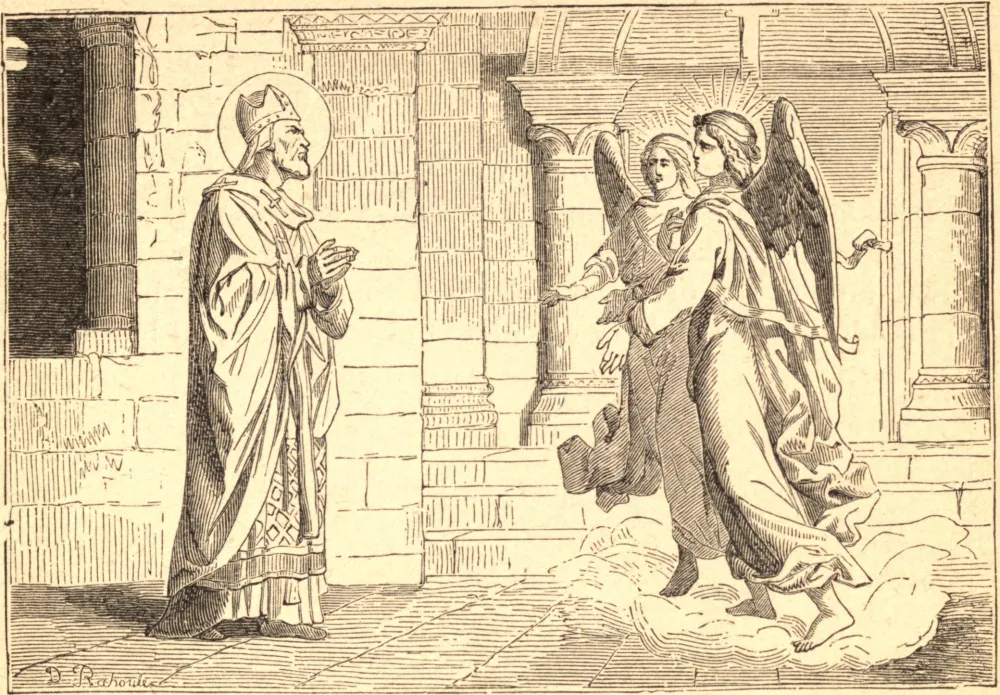

# 4 de janeiro — SÃO GREGÓRIO, Bispo

SÃO GREGÓRIO foi um dos principais senadores de Autun, e permaneceu, desde a morte de sua esposa, viúvo até a idade de cinquenta e sete anos, época em que, por suas singulares virtudes, foi consagrado Bispo de Langres, sé que governou com admirável prudência e zelo por trinta e três anos, santificando seus labores pastorais pela mais profunda humildade, oração assídua, e extraordinária abstinência e mortificação. Um número incrível de infiéis foi por ele convertido da idolatria, e cristãos mundanos de suas desordens.

Morreu por volta do princípio do ano 541, mas alguns dias depois da Epifania. Por devoção a São Benigno, desejou ser sepultado perto do túmulo daquele Santo em Dijon; isto foi executado por seu virtuoso filho Tetrico, que lhe sucedeu em seu bispado.
