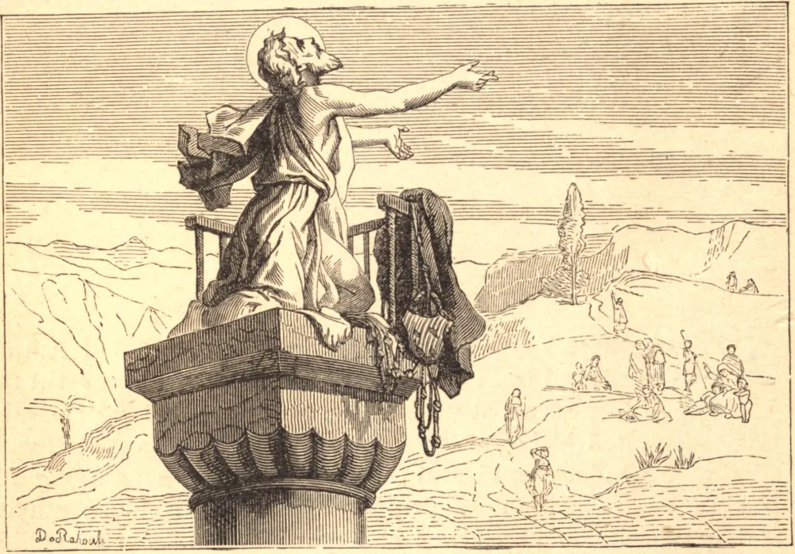

# 5 de janeiro — SÃO SIMEÃO ESTILITA

CERTO dia de inverno, por volta do ano 401, a neve jazia espessa ao redor de Sisan, uma pequena cidade da Cilícia. Um menino pastor, que não podia levar suas ovelhas aos campos por causa do frio, foi à igreja em vez disso, e ouviu as oito Bem-aventuranças, que foram lidas naquela manhã. Perguntou como se haviam de obter estas bênçãos, e, quando lhe falaram da vida monástica, surgiu dentro dele uma sede de perfeição. Tornou-se a maravilha do mundo, o grande São Simeão Estilita. Foi advertido de que a perfeição lhe custaria caro, e assim foi. Ainda criança, começou a vida monástica, e nela passou uma dúzia de anos em austeridade sobre-humana. Cingiu uma corda em torno da cintura até que a carne ficou putrefata. Comia apenas uma vez a cada sete dias, e, quando Deus o conduziu a uma vida solitária, guardava jejuns de quarenta dias. Trinta e sete anos passou no alto de colunas, exposto ao calor e ao frio, dia e noite adorando a majestade de Deus. A perfeição era tudo para São Simeão; os meios, nada, exceto na medida em que Deus os escolhia para ele. Os solitários do Egito desconfiavam de uma vida tão nova e tão estranha, e enviaram um dentre eles para mandar São Simeão descer de sua coluna e voltar à vida comum. Num instante o Santo aprontou-se para descer; mas o religioso egípcio ficou satisfeito com esta prova de humildade. "Fica", disse ele, "e tem ânimo; teu modo de vida vem de Deus."

A alegria, a humildade e a obediência puseram seu selo sobre as austeridades de São Simeão. As palavras que Deus pôs em sua boca trouxeram multidões de pagãos ao batismo e de pecadores à penitência. Por fim, no ano 460, aqueles que vigiavam embaixo perceberam que ele estivera imóvel três dias inteiros. Subiram, e acharam o corpo do ancião ainda curvado na atitude de oração, mas sua alma estava com Deus. Por mais extraordinária que possa parecer a vida de São Simeão, ela nos ensina duas lições claras e práticas: Primeira, devemos renovar constantemente em nós mesmos um intenso desejo de perfeição. Segunda, devemos usar com fidelidade e coragem os meios de perfeição que Deus nos aponta.

## Reflexão

Santo Agostinho diz: "Este é o negócio de nossa vida: por esforço e por labuta, por oração e súplica, avançar na graça de Deus, até que cheguemos àquela altura de perfeição em que, com corações puros, possamos contemplar a Deus."
