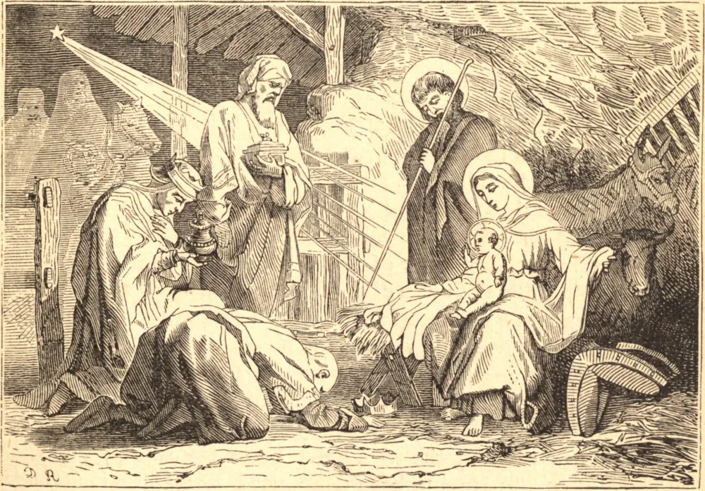

# 6 de janeiro — A EPIFANIA DE NOSSO SENHOR

A palavra Epifania significa "manifestação", e passou à aceitação geral em toda a Igreja universal, pelo fato de que Jesus Cristo *manifestou* aos olhos dos homens Sua divina missão neste dia, antes de tudo, quando uma estrela milagrosa revelou Seu nascimento aos reis do Oriente, os quais, apesar das dificuldades e perigos de uma longa e fatigante jornada por desertos e montanhas quase intransponíveis, apressaram-se de imediato para Belém para adorá-Lo e para oferecer-Lhe presentes místicos, como ao Rei dos reis, ao Deus do céu e da terra, e a um Homem, ainda assim, débil e mortal. A segunda manifestação foi quando, saindo das águas do Jordão, depois de ter recebido o Batismo das mãos de São João, o Espírito Santo desceu sobre Ele em forma visível de pomba, e uma voz do céu se ouviu, dizendo: "Este é o Meu Filho amado, em Quem ponho a Minha complacência." A terceira manifestação foi a de Seu divino poder, quando, no banquete de núpcias de Caná, mudou a água em vinho, à vista do que Seus discípulos creram Nele. A lembrança destes três grandes acontecimentos, concorrendo para o mesmo fim, a Igreja quis celebrar numa só e mesma festividade.

## Reflexão

Admirai o poder todo-poderoso deste pequeno Menino, que desde Seu berço dá a conhecer Sua vinda aos pastores e aos magos — aos pastores por meio de Seu anjo, aos magos por uma estrela no Oriente. Admirai a docilidade destes reis. Jesus nasce; ei-los a Seus pés. Sejamos pequenos, escondamo-nos, e a força divina nos será concedida. Sejamos dóceis e prontos em seguir as inspirações divinas, e tornar-nos-emos então sábios da sabedoria de Deus, poderosos em Seu poder todo-poderoso.
