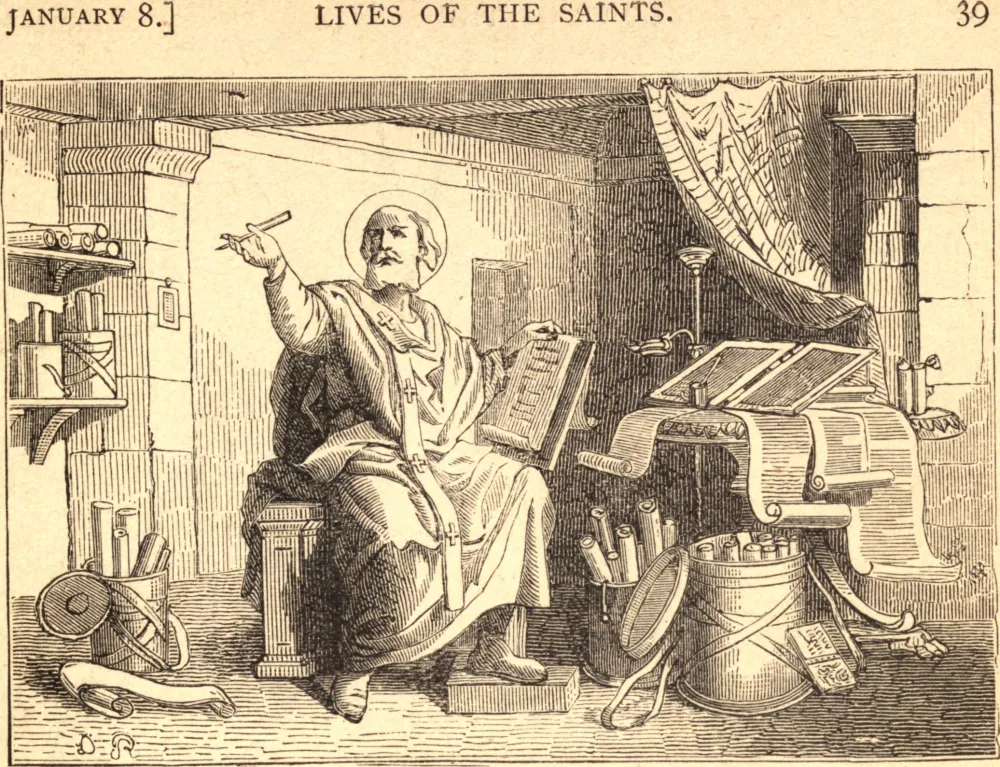

# 7 de janeiro — SÃO LUCIANO, Mártir

SÃO LUCIANO nasceu em Samósata, na Síria. Tendo perdido os pais na juventude, distribuiu aos pobres todos os seus bens terrenos, dos quais herdara abundante porção, e retirou-se para Edessa, a fim de viver junto a um santo homem chamado Macário, que lhe imbuiu a mente com o conhecimento das Sagradas Escrituras e o conduziu à prática das virtudes cristãs. Tendo-se tornado sacerdote, repartia o tempo entre os deveres externos de seu santo estado, a prática de obras de caridade e o estudo da literatura sagrada. Revisou os livros do Antigo e do Novo Testamento, expurgando os erros que se haviam infiltrado no texto, fosse pela negligência dos copistas, fosse pela malícia dos hereges, preparando assim o caminho para São Jerônimo, que pouco depois daria ao mundo a tradução latina conhecida como "a Vulgata".

Tendo sido denunciado como cristão, Luciano foi lançado na prisão e condenado à tortura, que se prolongou por doze dias inteiros. Alguns cristãos visitaram-no no cárcere, na festa da Epifania, e trouxeram-lhe pão e vinho; estando ligado e acorrentado de costas, consagrou os divinos mistérios sobre o próprio peito e comungou os fiéis ali presentes. Concluiu sua gloriosa carreira na prisão e morreu com as palavras "Sou cristão" nos lábios.

**Reflexão**—Se quisermos manter pura a nossa fé, devemos estudar suas santas verdades. Não podemos detectar a falsidade enquanto não conhecemos e amamos a verdade; e, para nós, a verdade não é uma abstração, mas uma Pessoa, Jesus Cristo, Deus e Homem.
