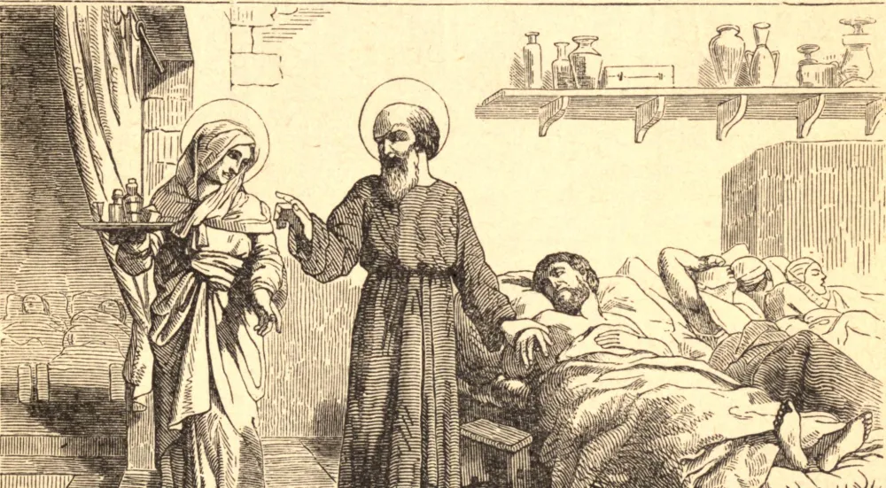

# 9 de janeiro — SÃO JULIÃO e SANTA BASILISSA, Mártires

SÃO JULIÃO e Santa Basilissa, embora casados, viveram, de mútuo consentimento, em perpétua castidade; santificaram-se pelos mais perfeitos exercícios de uma vida ascética e empregaram suas rendas no socorro dos pobres e dos enfermos. Para esse fim, converteram sua casa numa espécie de hospital, no qual por vezes acolhiam mil pobres. Basilissa atendia as de seu sexo, em aposentos separados dos homens; estes eram cuidados por Julião, que, por sua caridade, é chamado o Hospitalário. O Egito, onde viviam, começara então a abundar em exemplos de pessoas que, fosse nas cidades, fosse nos desertos, se entregavam aos mais perfeitos exercícios de caridade, penitência e mortificação.

Basilissa, depois de ter resistido a sete perseguições, morreu em paz; Julião sobreviveu-lhe muitos anos e recebeu a coroa de um glorioso martírio, juntamente com Celso, um jovem, Antônio, um sacerdote, Anastásio e Marcianila, a mãe de Celso.

Muitas igrejas e hospitais no Oriente, e sobretudo no Ocidente, levam o nome de um ou outro destes mártires. Quatro igrejas em Roma, e três de cinco em Paris, que levam o nome de São Julião, foram originalmente dedicadas sob o nome de São Julião, o Hospitalário e mártir. No tempo de São Gregório Magno, o crânio de São Julião foi trazido do Oriente para a França e dado à Rainha Brunehault; ela o deu ao convento de freiras que fundou em Étampes; parte dele encontra-se atualmente no mosteiro de Morigny, perto de Étampes, e parte na igreja das cônegas regulares de Santa Basilissa, em Paris.

**Reflexão**—Deus muitas vezes recompensa os homens pelas obras que lhe são agradáveis, dando-lhes graça e ocasião de realizar outras obras ainda mais elevadas. Santo Agostinho disse: "Nunca vi morrer de má morte um homem compassivo e caridoso."
