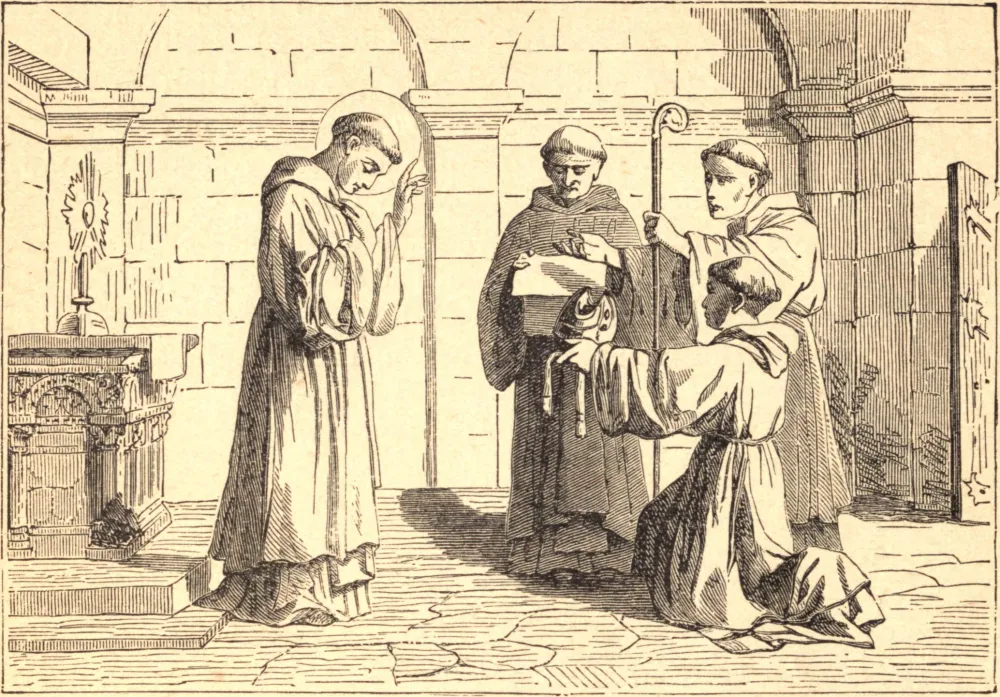

# 10 de janeiro — SÃO GUILHERME, Arcebispo

GUILHERME BERRUYER, da ilustre família dos antigos Condes de Nevers, foi educado por Pedro, o Eremita, Arcediago de Soissons, seu tio por parte de mãe. Desde a infância, Guilherme aprendeu a desprezar a loucura e a vacuidade do mundo, a abominar seus prazeres e a tremer ante seus perigos. Seu único deleite estava nos exercícios de piedade e nos seus estudos, nos quais empregava todo o seu tempo com infatigável aplicação. Foi feito cônego, primeiro de Soissons e depois de Paris; mas logo resolveu abandonar o mundo e retirou-se para a solidão de Grandmont, onde viveu com grande regularidade naquela austera Ordem, até que finalmente se uniu aos cistercienses, então em maravilhoso odor de santidade. Após algum tempo, foi escolhido Prior da Abadia de Pontigny e depois tornou-se Abade de Chaalis. À morte de Henrique de Sully, Arcebispo de Bourges, Guilherme foi escolhido para sucedê-lo. O anúncio dessa nova dignidade que sobre ele recaíra esmagou-o de aflição, e não teria aceitado o ofício se o Papa e seu Geral, o Abade de Cister, não lho houvessem ordenado. Seu primeiro cuidado em sua nova posição foi conformar a sua vida às mais perfeitas regras de santidade. Redobrou todas as suas austeridades, dizendo que agora lhe incumbia fazer penitência pelos outros tanto quanto por si mesmo. Trazia sempre um cilício sob o hábito religioso, e nunca acrescentava nada à sua veste no inverno nem a diminuía no verão; nunca comia carne alguma, embora a tivesse à sua mesa para os estrangeiros. Quando se aproximou o seu fim, foi, a seu pedido, deitado sobre cinzas em seu cilício, e nessa postura expirou no dia 10 de janeiro de 1209. Seu corpo foi sepultado em sua catedral e, sendo honrado por muitos milagres, foi exumado em 1217, e no ano seguinte Guilherme foi canonizado pelo Papa Honório III.

## Reflexão

Os campeões da fé provam a verdade de seu ensino não menos pela santidade de sua vida do que pela força de seus argumentos. Nunca te esqueças de que, para converter os outros, devemos primeiro cuidar de nossa própria alma.
