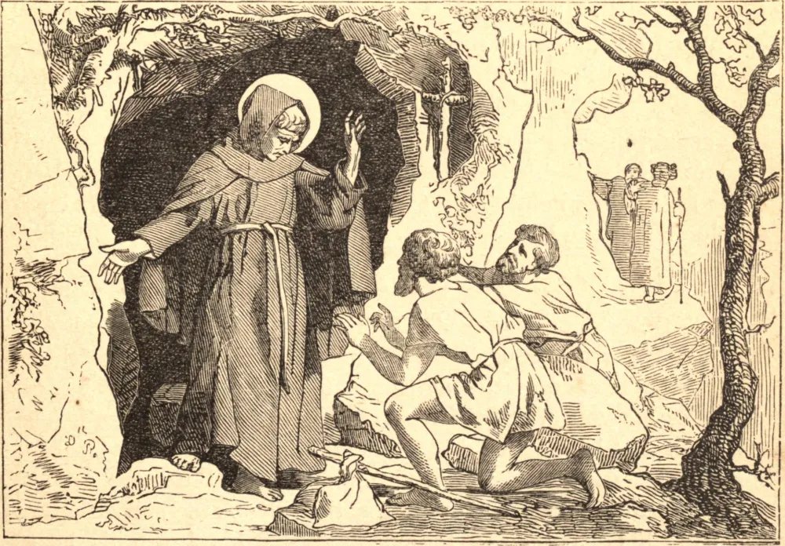

# 11 de janeiro — SÃO TEODÓSIO, O CENOBIARCA

TEODÓSIO nasceu na Capadócia em 423. O exemplo de Abraão impeliu-o a deixar a sua pátria, e seu desejo de seguir a Jesus Cristo atraiu-o à vida religiosa. Pôs-se sob a direção de Longino, um eremita muito santo, que o enviou a governar um mosteiro perto de Belém. Não podendo levar-se a comandar os outros, fugiu para uma caverna, onde viveu em penitência e oração. Sua grande caridade, porém, não lhe permitiu recusar o encargo de alguns discípulos que, poucos a princípio, vieram com o tempo a tornar-se vasta multidão, e Teodósio edificou para eles um grande mosteiro e três igrejas. Tornou-se, por fim, Superior das comunidades religiosas da Palestina. Teodósio acomodava-se tão cuidadosamente aos caracteres de seus súditos que suas repreensões eram mais amadas do que temidas. Mas certa vez foi obrigado a separar da comunhão dos demais um religioso culpado de uma falta grave. Em vez de aceitar humildemente sua sentença, o monge teve a arrogância de pretender excomungar Teodósio em vingança. Teodósio não pensou em indignação, nem em sua própria posição, mas submeteu-se mansamente a essa falsa e injusta excomunhão. Isso de tal modo tocou o coração de seu discípulo que ele logo se submeteu e reconheceu a sua falta. Teodósio nunca recusou auxílio a qualquer um que estivesse na pobreza ou na aflição; em alguns dias os monges punham mais de cem mesas para os necessitados. Em tempos de fome, Teodósio proibia que se diminuíssem as esmolas, e muitas vezes multiplicava milagrosamente as provisões. Edificou também cinco hospitais, nos quais servia amorosamente os enfermos, enquanto, pela assídua leitura espiritual, mantinha-se em perfeito recolhimento. Combateu com sucesso a heresia eutiquiana em Jerusalém, e por isso foi banido pelo imperador. Sofreu uma longa e dolorosa enfermidade, e recusava-se a orar para ser curado, chamando-a de salutar penitência por seus êxitos passados. Morreu com a idade de cento e seis anos.

## Reflexão

São Teodósio, por amor da caridade, sacrificou tudo o que mais prezava — o seu lar pelo amor de Deus, e a sua solidão pelo amor do próximo. Pode ser verdadeira a nossa caridade, se pouco ou nada nos custa?
