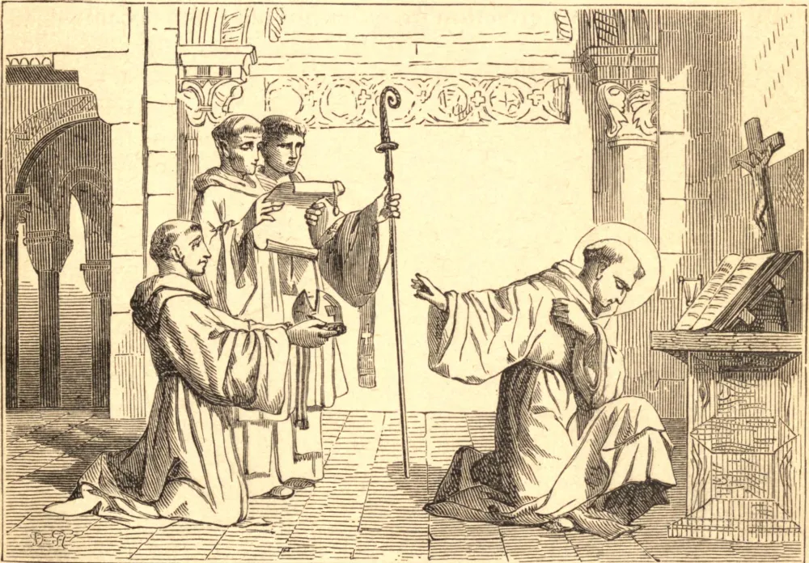

# 12 de janeiro — SANTO ELREDO, Abade

"UMA coisa te falta." Com estas palavras, Deus chamou Elredo da corte de um Santo rei, Davi da Escócia, para o silêncio do claustro. Deixou o rei, os companheiros de sua juventude e um amigo muito caro, para obedecer ao chamado. Somente a convicção de que no mundo a sua alma estava em perigo lhe permitiu romper tais laços. Muito tempo depois, a amargura da separação permaneceu viva em sua alma, e ele declarou que, "embora houvesse deixado os seus entes queridos quanto ao corpo, para servir ao seu Senhor, o seu coração estava sempre com eles." Entrou na Ordem Cisterciense, e mesmo ali o seu anseio por afeto manifestou-se numa atração especial por um dos irmãos, chamado Simão. Este santo monge deixara o mundo na sua juventude, e parecia como surdo e mudo, de tão absorto que estava em Deus. Certo dia, Elredo, esquecendo por um momento a regra do silêncio perpétuo, falou-lhe. No mesmo instante, prostrou-se a seus pés em sinal de sua falta; mas o olhar de dor e de desagrado de Simão atormentou-o por muitos anos, e ensinou-lhe a não deixar que sentimento humano algum perturbasse, nem por um momento, a sua união com Deus. Certo noviço veio um dia ter com Elredo, dizendo que precisava voltar ao mundo. Mas Elredo havia pedido a sua alma a Deus, e respondeu: "Irmão, não te arruínes; contudo, não o poderás, ainda que o quisesses." Ele, porém, não quis ouvir, e vagou por entre as colinas, pensando todo o tempo que estava indo para longe da abadia. Ao pôr do sol, encontrou-se diante de um convento estranhamente semelhante a Rieveaux, e assim era de fato. O primeiro monge que encontrou foi Elredo, que lhe lançou os braços ao pescoço, dizendo: "Filho, por que assim agiste comigo? Eis que chorei por ti com muitas lágrimas, e confio em Deus que, como lhe pedi, tu não perecerás." O mundo não ama assim os seus amigos. Por ordem de seus superiores, Elredo compôs as suas grandes obras, a *Amizade Espiritual* e o *Espelho da Caridade*. Nesta última, diz que o verdadeiro amor de Deus só se obtém unindo-nos em todas as coisas à Paixão de Cristo. Morreu em 1167, fundador e Abade de Rieveaux, o mais austero mosteiro da Inglaterra, e Superior de cerca de trezentos monges.

## Reflexão

Quando um homem se entregou a Deus, Deus lhe devolve a amizade, com todos os seus outros dons, cêntuplo. Os amigos são então amados não mais por si mesmos somente, mas por Deus, e isso com um amor vivo e terno; pois Deus pode facilmente purificar o sentimento. Não é o sentimento, mas o amor-próprio, que corrompe a amizade.
