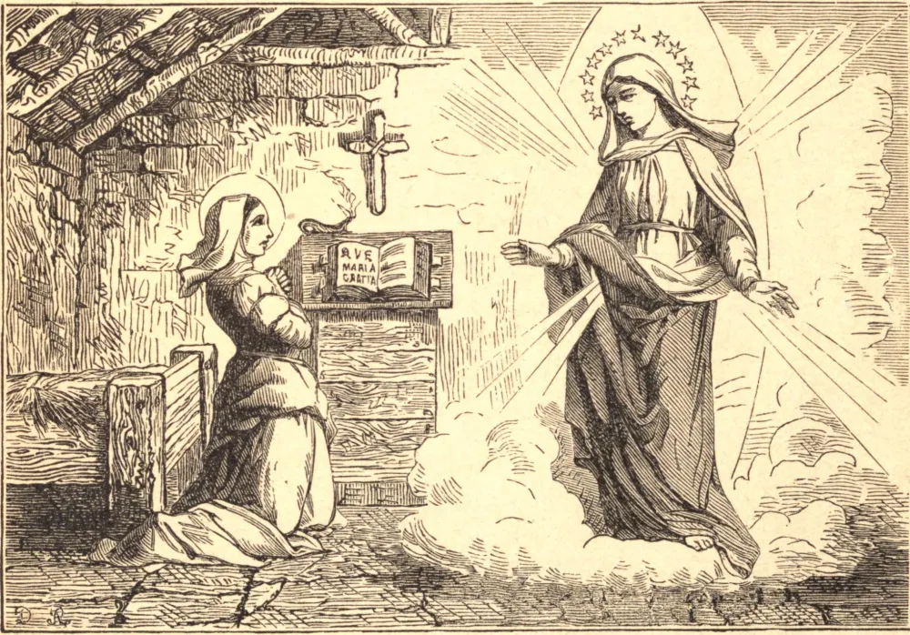

# 13 de janeiro — SANTA VERÔNICA DE MILÃO

OS PAIS de Verônica eram camponeses de uma aldeia perto de Milão. Desde a infância, ela labutava arduamente na casa e no campo, e cumpria alegremente toda tarefa servil. Aos poucos, o desejo de perfeição cresceu dentro dela; tornou-se surda às pilhérias e às canções de suas companheiras, e por vezes, ao ceifar e cavar, escondia o rosto e chorava. Não conhecendo as letras, começou a inquietar-se quanto à sua instrução, e levantava-se secretamente à noite para ensinar a si mesma a ler. Nossa Senhora disse-lhe que outras coisas eram necessárias, mas não esta. Mostrou a Verônica três letras místicas que lhe ensinariam mais do que os livros. A primeira significava a pureza de intenção; a segunda, o horror à murmuração ou à crítica; a terceira, a meditação diária sobre a Paixão. Pela primeira, ela aprendeu a começar os seus deveres diários por nenhum motivo humano, mas por Deus somente; pela segunda, a levar a cabo o que assim começara, atendendo aos seus próprios assuntos, nunca julgando o próximo, mas orando por aqueles que manifestamente erravam; pela terceira, foi capacitada a esquecer as suas próprias dores e tristezas nas de seu Senhor, e a chorar a cada hora, mas em silêncio, sobre a memória dos agravos que Ele sofreu. Tinha êxtases contínuos, e via em visões sucessivas toda a vida de Jesus, e muitos outros mistérios. Contudo, por uma graça especial, nem os seus arrebatamentos nem as suas lágrimas jamais interromperam os seus labores, que só terminaram com a morte. Após três anos de paciente espera, foi recebida como irmã conversa no convento de Santa Marta, em Milão. A comunidade era extremamente pobre, e o dever de Verônica era mendigar pela cidade o seu alimento diário. Três anos depois de receber o hábito, foi afligida por dores corporais secretas mas constantes, e nunca consentiu, porém, em ser aliviada de qualquer de seus labores, ou em omitir uma só de suas orações. Pela exata obediência, tornou-se uma cópia viva da regra, e obedecia com um sorriso à menor insinuação de sua Superiora. Buscou até o fim as ocupações mais duras e humilhantes, e em sua prática gozou de alguns dos mais altos favores jamais concedidos a uma Santa. Morreu em 1497, no dia que predissera, após uma enfermidade de seis meses, com a idade de cinquenta e dois anos, e no trigésimo de sua profissão religiosa.

## Reflexão

Quando Verônica era instada, na doença, a aceitar alguma dispensa de seus labores, sua única resposta era: "Devo trabalhar enquanto posso, enquanto tenho tempo." Ousaremos, então, desperdiçar o nosso?
