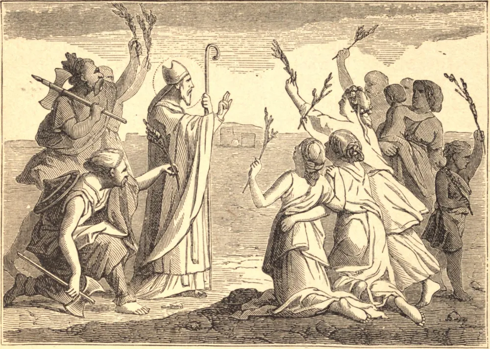

# 14 de janeiro — SANTO HILÁRIO DE POITIERS

SANTO HILÁRIO era natural de Poitiers, na Aquitânia. Nascido e educado pagão, foi só perto da meia-idade que abraçou o cristianismo, movido a isso principalmente pela ideia de Deus que lhe era apresentada nas Sagradas Escrituras. Logo converteu sua esposa e sua filha, e separou-se rigorosamente de toda companhia não católica. No início de sua conversão, Santo Hilário não comia com judeus ou hereges, nem os saudava pelo caminho; mas depois, por amor deles, relaxou essa severidade. Entrou nas Ordens Sagradas, e em 353 foi escolhido bispo de sua cidade natal. O arianismo, sob a proteção do Imperador Constâncio, estava então no auge de seu poder, e Santo Hilário viu-se chamado a sustentar a causa ortodoxa em vários concílios gálicos, nos quais os bispos arianos formavam uma maioria esmagadora. Foi, em consequência, acusado ao imperador, que o baniu para a Frígia. Passou os seus três anos e mais de exílio compondo as suas grandes obras sobre a Trindade. Em 359, assistiu ao Concílio de Selêucia, no qual arianos, semiarianos e católicos contendiam pelo domínio. Com os delegados do concílio, dirigiu-se a Constantinopla, e ali de tal modo desconcertou os chefes do partido ariano que estes persuadiram o imperador a deixá-lo voltar à Gália. Percorreu a Gália, a Itália e a Ilíria, em toda parte onde chegava confundindo os hereges e procurando o triunfo da ortodoxia. Após sete ou oito anos de viagens missionárias, regressou a Poitiers, onde morreu em paz em 368.

## Reflexão

Assim como Santo Hilário, também nós somos chamados a um combate de toda a vida contra os hereges; teremos êxito na medida em que combinarmos o ódio à heresia com a compaixão por suas vítimas.
