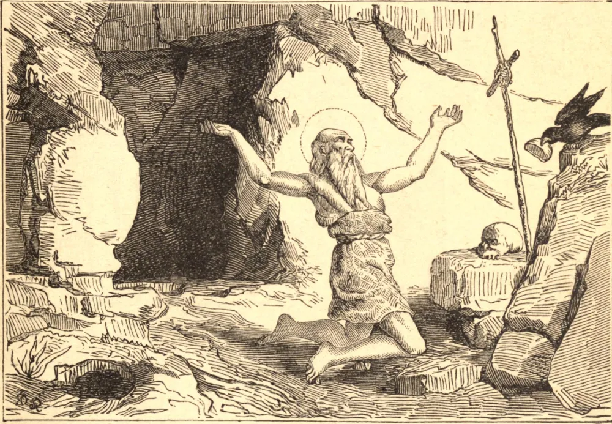

# 15 de janeiro — SÃO PAULO, o Primeiro Eremita

SÃO PAULO nasceu no Alto Egito, por volta do ano 230, e ficou órfão aos quinze anos. Era muito rico e altamente instruído. Temendo que as torturas de uma terrível perseguição pudessem pôr em perigo a sua perseverança cristã, retirou-se para uma aldeia remota. Mas seu cunhado pagão o denunciou, e São Paulo, antes de permanecer onde a sua fé estava em perigo, entrou no deserto estéril, confiando que Deus supriria as suas necessidades. E sua confiança foi recompensada; pois, no lugar a que a Providência o conduziu, encontrou o fruto da palmeira como alimento, e suas folhas como vestimenta, e a água de uma fonte para beber. Seu primeiro intento era voltar ao mundo quando a perseguição terminasse; mas, saboreando grandes delícias na oração e na penitência, permaneceu o resto de sua vida, noventa anos, em penitência, oração e contemplação.

Deus revelou a sua existência a Santo Antão, que o buscou por três dias. Vendo uma loba sedenta correr por uma abertura nas rochas, Antão seguiu-a à procura de água, e encontrou Paulo. Reconheceram-se logo um ao outro, e louvaram a Deus juntos. Quando Santo Antão o visitou, um corvo trouxe-lhe um pão, e São Paulo disse: "Vê como Deus é bom! Por sessenta anos esta ave me trouxe meio pão todos os dias; agora que tu vieste, Cristo dobrou a provisão para os seus servos."

Tendo passado a noite em oração, ao romper do dia Paulo disse a Antão que estava prestes a morrer, e pediu para ser sepultado no manto que Santo Atanásio dera a Antão. Antão apressou-se a buscá-lo, e em seu caminho de volta viu Paulo subir ao céu em glória. Encontrou o seu corpo morto, ajoelhado como se estivesse em oração, e dois leões vieram e cavaram a sua sepultura. Paulo morreu no seu centésimo décimo terceiro ano.

**Reflexão**—Nunca nos arrependeremos de ter confiado em Deus, pois Ele não pode faltar àqueles que se apoiam n'Ele; nem jamais confiaremos em nós mesmos sem sermos enganados.
