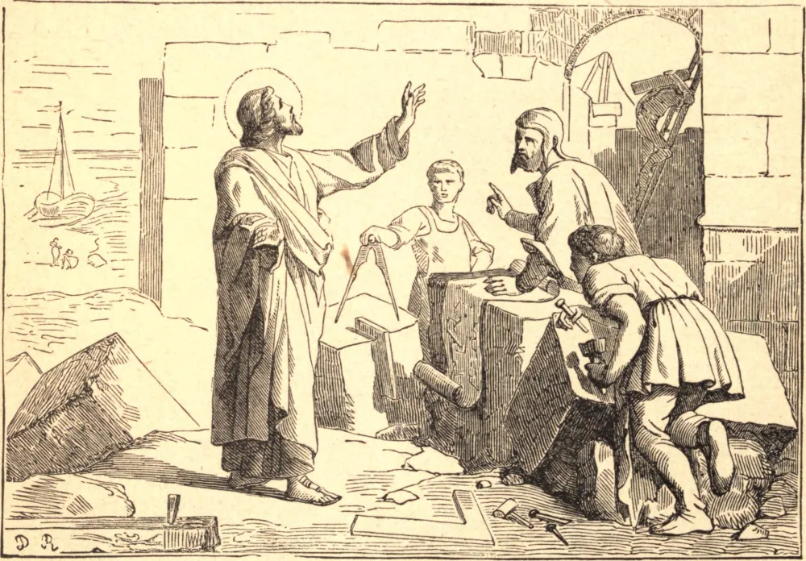

# 16 de janeiro — SANTO HONORATO, Arcebispo

SANTO HONORATO era de uma família consular romana estabelecida na Gália. Em sua juventude, renunciou ao culto dos ídolos, e ganhou para Cristo seu irmão mais velho, Venâncio. Convencidos da vacuidade das coisas deste mundo, desejavam renunciar a ele com todos os seus prazeres, mas um pai pagão e extremoso punha contínuos obstáculos em seu caminho. Por fim, tomando consigo São Caprásio, um santo eremita, por seu diretor, partiram de Marselha para a Grécia, com a intenção de ali viver desconhecidos em algum deserto. Venâncio logo morreu felizmente em Metona, e Honorato, estando também doente, foi obrigado a regressar com o seu condutor.

Levou primeiro uma vida eremítica nas montanhas perto de Frejus. Duas pequenas ilhas jazem no mar perto daquela costa; na menor, hoje conhecida como Santo Honoré, estabeleceu-se o nosso Santo, e, sendo seguido por outros, ali fundou o famoso mosteiro de Lerins, por volta do ano 400. Alguns de seus seguidores ele destinou a viver em comunidade; outros, que pareciam mais perfeitos, em celas separadas como anacoretas. Sua regra foi principalmente tomada da de São Pacômio. Nada pode ser mais amável do que a descrição que Santo Hilário fez das excelentes virtudes desta companhia de santos, especialmente da caridade, concórdia, humildade, compunção e devoção que reinavam entre eles sob a condução de nosso santo abade. Foi, por compulsão, consagrado Arcebispo de Arles em 426, e morreu, exaurido pelas austeridades e pelos labores apostólicos, em 429.

**Reflexão**—A alma não pode verdadeiramente servir a Deus enquanto está envolvida nas distrações e nos prazeres do mundo. Santo Honorato sabia disso, e escolheu ser servo de Cristo, seu Senhor. Resolve, em qualquer estado em que te encontres, viver absolutamente desapegado do mundo, e separar-te dele tanto quanto possível.
