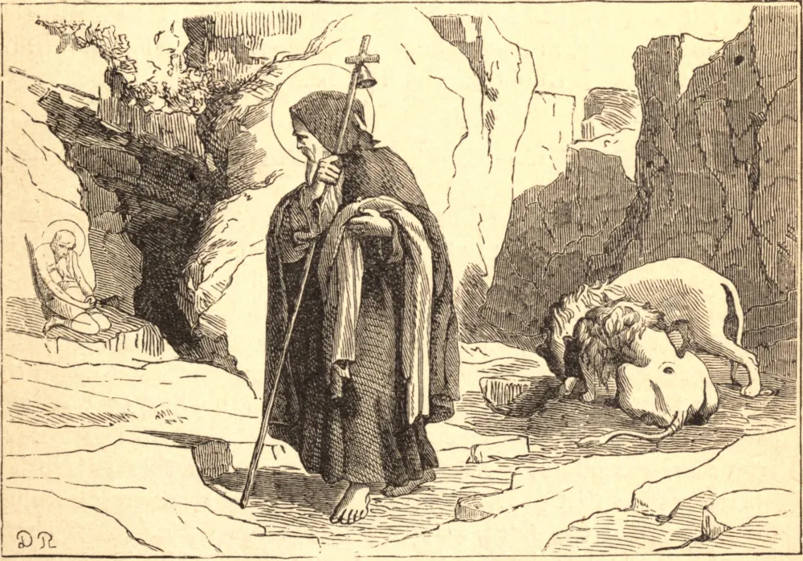

# 17 de janeiro — SANTO ANTÃO, Patriarca dos Monges

SANTO ANTÃO nasceu no ano 251, no Alto Egito. Ouvindo na Missa as palavras "Se queres ser perfeito, vai, vende o que tens e dá aos pobres", deu de presente todos os seus vastos bens. Em seguida, suplicou a um idoso eremita que lhe ensinasse a vida espiritual. Visitou também vários solitários, copiando em si mesmo a principal virtude de cada um.

Para servir a Deus mais perfeitamente, Antão entrou no deserto e enclausurou-se numa ruína, tapando a porta de modo que ninguém pudesse entrar. Ali os demônios o assaltaram com a maior fúria, aparecendo sob a forma de vários monstros, e até ferindo-o gravemente; mas a sua coragem jamais faltou, e ele os venceu a todos pela confiança em Deus e pelo sinal da cruz.

Certa noite, enquanto Antão estava em sua solidão, muitos demônios o flagelaram tão terrivelmente que ele jazia como morto. Um amigo encontrou-o assim e, julgando-o morto, levou-o para casa. Mas, quando Antão tornou a si, persuadiu o amigo a carregá-lo, a despeito de suas feridas, de volta à sua solidão. Ali, prostrado de fraqueza, desafiou os demônios, dizendo: "Não vos temo; não podeis separar-me do amor de Cristo." Após mais vãos assaltos, os demônios fugiram, e Cristo apareceu a Antão em glória.

Seu único alimento era pão e água, que nunca provava antes do pôr do sol, e por vezes só uma vez a cada dois, três ou quatro dias. Vestia cilício e pele de ovelha, e muitas vezes permanecia de joelhos em oração do pôr ao nascer do sol. Muitas almas afluíam a ele em busca de conselho, e, após vinte anos de solidão, consentiu em guiá-las na santidade — fundando assim o primeiro mosteiro. Seus numerosos milagres atraíam tais multidões que ele fugiu de novo para a solidão, onde vivia do trabalho manual. Expirou pacificamente em idade muito avançada. Santo Atanásio, seu biógrafo, diz que o simples conhecimento de como viveu Santo Antão é um bom guia para a virtude.

**Reflexão**—Quanto mais violentos eram os assaltos da tentação sofridos por Santo Antão, tanto mais firmemente empunhava ele as suas armas, a saber, a mortificação e a oração. Imitemo-lo nisto, se quisermos obter vitórias como as suas.
