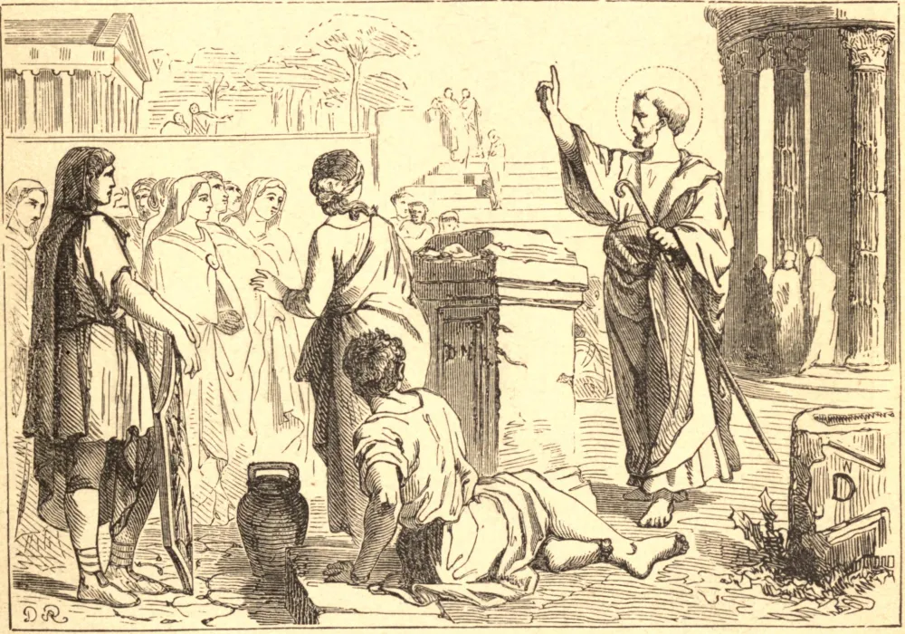

# 18 de janeiro — A CÁTEDRA DE SÃO PEDRO EM ROMA

TENDO SÃO PEDRO triunfado sobre o demônio no Oriente, este o perseguiu até Roma na pessoa de Simão Mago. Aquele que outrora tremera ante a voz de uma pobre criada já não temia agora o próprio trono da idolatria e da superstição. A capital do império do mundo, e o centro da impiedade, reclamava o zelo do Príncipe dos Apóstolos. Deus estabelecera o Império Romano, e estendera o seu domínio para além do de qualquer monarquia anterior, para a mais fácil propagação de seu Evangelho. Sua metrópole era da maior importância para esse empreendimento.

São Pedro tomou para si aquela província e, dirigindo-se a Roma, ali pregou a fé e estabeleceu a sua cátedra eclesiástica. Que São Pedro pregou em Roma, ali fundou a Igreja, e ali morreu pelo martírio sob Nero, são fatos os mais incontestáveis, pelo testemunho de todos os escritores de diversos países que viveram próximos àquele tempo; pessoas de inquestionável veracidade, e que não podiam deixar de estar informadas da verdade num ponto tão interessante e, por sua própria natureza, tão público e notório. Isso é também atestado por monumentos de toda espécie; pelas prerrogativas, direitos e privilégios de que aquela igreja gozou, desde aquelas eras primitivas, em consequência deste título.

Era um antigo costume observado pelas igrejas celebrar uma festividade anual da consagração de seus bispos. A festa da Cátedra de São Pedro encontra-se em antigos martirológios. Os cristãos com justiça celebram a fundação desta igreja-mãe, o centro da comunhão católica, em ação de graças a Deus por suas misericórdias para com a sua Igreja, e para implorar as suas futuras bênçãos.

**Reflexão**—Como uma das maiores misericórdias de Deus para com a sua Igreja, peçamos-lhe encarecidamente que suscite nela pastores zelosos, eminentemente repletos de seu Espírito, com o qual animou os seus apóstolos.
