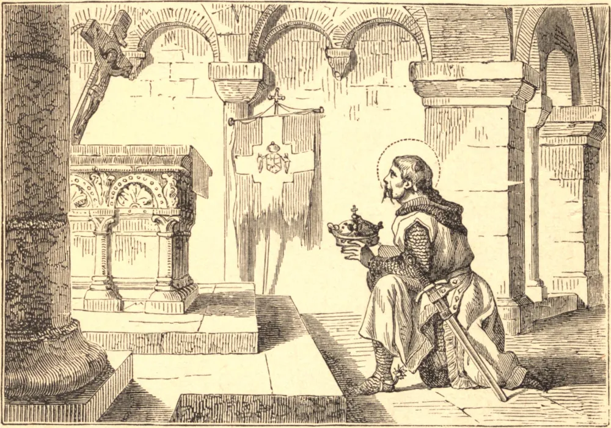

# 19 de janeiro — SÃO CANUTO, Rei, Mártir

SÃO CANUTO, Rei da Dinamarca, foi dotado de excelentes qualidades tanto de espírito quanto de corpo. É difícil dizer se sobressaía mais na coragem ou na conduta e perícia na guerra; mas a sua singular piedade eclipsava todos os seus demais dotes. Limpou os mares dos piratas e subjugou várias províncias vizinhas que infestavam a Dinamarca com as suas incursões.

O reino da Dinamarca foi eletivo até o ano de 1660, e, quando o pai de Canuto morreu, o seu irmão mais velho, Haroldo, foi chamado ao trono. Haroldo morreu após reinar por dois anos, e Canuto foi escolhido para sucedê-lo. Começou o seu reinado com uma guerra bem-sucedida contra os turbulentos e bárbaros inimigos do Estado, e plantando a fé nas províncias conquistadas. Em meio à glória das suas vitórias, prostrava-se humildemente ao pé do crucifixo, depondo ali o seu diadema e oferecendo a si mesmo e ao seu reino ao Rei dos reis. Tendo provido a paz e a segurança do seu país, desposou Eltha, filha de Roberto, Conde de Flandres, que se mostrou esposa digna dele.

A sua preocupação seguinte foi reformar os abusos em casa. Para esse fim, promulgou leis severas mas necessárias para a estrita administração da justiça, e reprimiu a violência e a tirania dos grandes, sem acepção de pessoas. Favoreceu e honrou os homens santos, e concedeu muitos privilégios e imunidades ao clero. A sua caridade e ternura para com os seus súditos o levaram a estudar por todos os meios possíveis o modo de torná-los um povo feliz. Mostrou uma munificência real na construção e ornamentação de igrejas, e deu a coroa que usava, de valor extraordinariamente grande, a uma igreja na sua capital e local de residência, onde os reis da Dinamarca ainda são sepultados.

Às virtudes que constituem um grande rei, Canuto acrescentou aquelas que provam o grande santo. Tendo surgido uma rebelião no seu reino, o rei foi surpreendido na igreja pelos rebeldes. Percebendo o seu perigo, confessou os seus pecados ao pé do altar e recebeu a Sagrada Comunhão. Estendendo os braços diante do altar, o Santo recomendou fervorosamente a sua alma ao seu Criador; nessa postura foi atingido por um dardo arremessado por uma janela, e caiu como vítima por amor de Cristo.

**Reflexão**—A alma do homem é dotada de muitas faculdades nobres, e sente uma viva alegria no seu exercício; mas a mais viva alegria que somos capazes de sentir consiste em prostrar todas as faculdades do espírito e do coração na mais humilde adoração diante da majestade de Deus.
