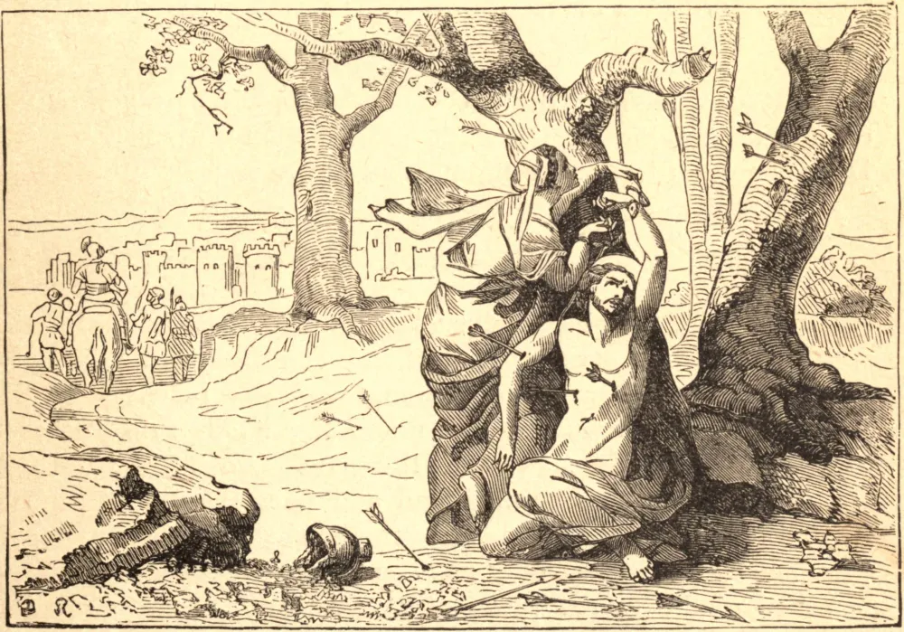

# 20 de janeiro — SÃO SEBASTIÃO, Mártir

SÃO SEBASTIÃO foi um oficial do exército romano, estimado até pelos pagãos como bom soldado, e honrado pela Igreja desde então como campeão de Jesus Cristo. Nascido em Narbona, Sebastião veio a Roma por volta do ano 284, e entrou em liça contra os poderes do mal.

Encontrou os irmãos gêmeos Marcos e Marcelino na prisão por causa da fé, e, quando estavam prestes a ceder às súplicas dos seus parentes, encorajou-os a desprezar a carne e o sangue, e a morrer por Cristo. Deus confirmou as suas palavras com milagres: uma luz brilhava ao seu redor enquanto falava; curava os enfermos com as suas orações; e nessa força divina conduziu multidões à fé, entre elas o Prefeito de Roma, com o seu filho Tibúrcio. Viu os seus discípulos morrerem antes dele, e um deles voltou do céu para lhe dizer que o seu próprio fim estava próximo.

Foi numa disputa de fervor e caridade que São Sebastião encontrou a ocasião do martírio. O Prefeito de Roma, após a sua conversão, retirou-se para as suas propriedades na Campânia, e levou consigo um grande número dos seus conversos para esse lugar de segurança. Era questão saber se o sacerdote Policarpo ou São Sebastião deveria acompanhar os neófitos. Cada um estava ávido por permanecer e enfrentar o perigo em Roma, e por fim o Papa decidiu que a igreja romana não podia dispensar os serviços de Sebastião.

Continuou a trabalhar no posto de perigo até ser traído por um falso discípulo. Foi levado diante de Diocleciano e, por ordem do imperador, traspassado de flechas e deixado por morto. Mas Deus o ergueu novamente, e por sua própria vontade foi diante do imperador e o conjurou a deter a perseguição da Igreja. Condenado outra vez, foi por fim açoitado até a morte com clavas, e coroou os seus trabalhos com o mérito de um duplo martírio.

**Reflexão**—As tuas ocupações ordinárias te darão oportunidades de trabalhar pela fé. Pede auxílio a São Sebastião. Ele não era sacerdote nem religioso, mas soldado.
