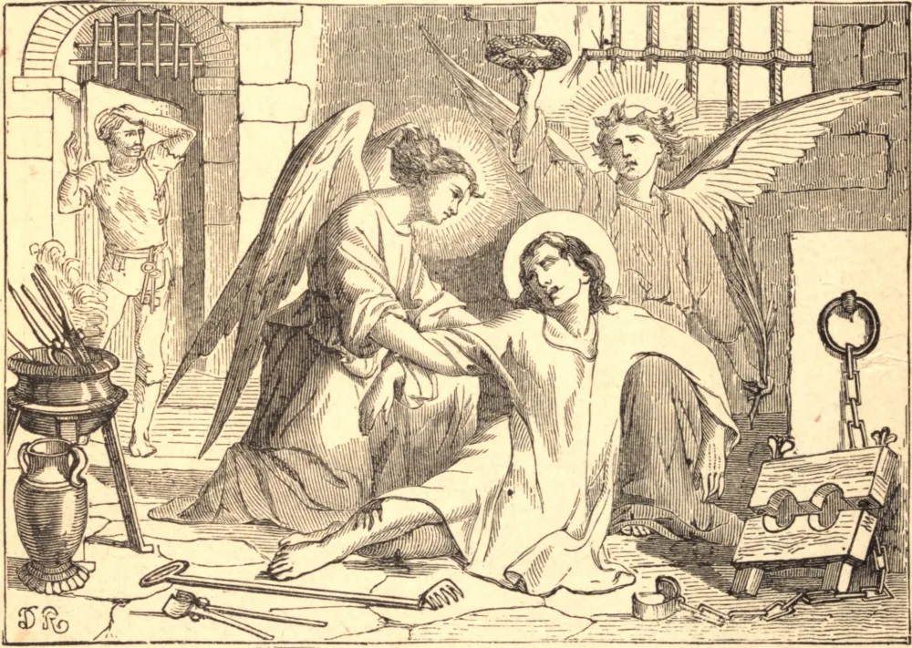

# 22 de janeiro — SÃO VICENTE, Mártir

VICENTE foi arcediago da igreja de Saragoça. Valeriano, o bispo, tinha um impedimento na fala; assim, Vicente pregava em seu lugar, e respondia em seu nome quando ambos foram levados diante de Daciano, o presidente, durante a perseguição de Diocleciano. Quando o bispo foi enviado ao desterro, Vicente permaneceu para sofrer e morrer. Antes de tudo, foi estendido no potro; e, quando estava quase despedaçado, Daciano, o presidente, perguntou-lhe em escárnio "como se sentia agora." Vicente respondeu, com alegria no rosto, que sempre orara para estar como então estava. Em vão Daciano golpeou os carrascos e os incitou ao seu trabalho selvagem. A carne do mártir foi rasgada com ganchos; foi amarrado numa cadeira de ferro em brasa; toucinho e sal foram esfregados nas suas feridas; e em meio a tudo isso conservou os olhos erguidos ao céu, e permaneceu impassível. Foi lançado num calabouço solitário, com os pés no tronco; mas os anjos de Cristo iluminaram a escuridão, e asseguraram a Vicente que estava próximo do seu triunfo. As suas feridas foram então tratadas para o preparar para novos tormentos, e foi permitido aos fiéis contemplar o seu corpo dilacerado. Vinham em tropas, beijavam as chagas abertas, e levavam como relíquias panos embebidos no seu sangue. Antes que os tormentos pudessem recomeçar, chegou a hora do mártir, e ele exalou a sua alma em paz.

Mesmo os corpos mortos dos santos são preciosos aos olhos de Deus, e a mão da iniquidade não pode tocá-los. Um corvo guardou o corpo de Vicente onde jazia lançado sobre a terra. Quando foi afundado no mar, as ondas o lançaram à praia; e as suas relíquias são conservadas até hoje no mosteiro agostiniano de Lisboa, para consolação da Igreja de Cristo.

## Reflexão

Desejas estar em paz em meio ao sofrimento e à tentação? Então faze do teu principal empenho crescer nos hábitos de oração e na união com Cristo. Tem confiança n'Ele. Ele te fará vitorioso sobre os teus inimigos espirituais e sobre ti mesmo. Iluminará a tua escuridão e adoçará os teus sofrimentos, e na tua solidão e desolação se aproximará de ti com os seus santos anjos.
