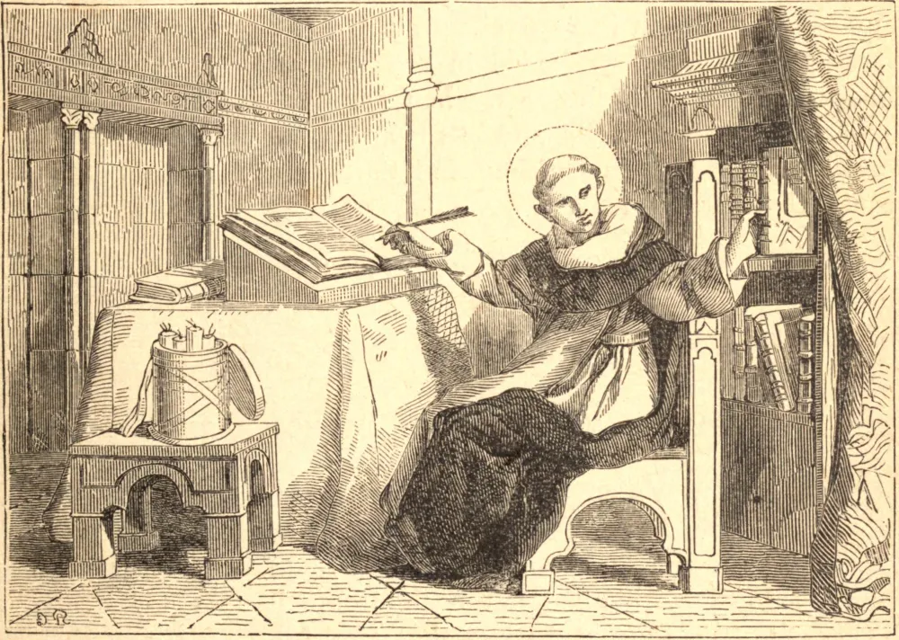

# 23 de janeiro — SÃO RAIMUNDO DE PENAFORT

NASCIDO no ano 1175, de nobre família espanhola, Raimundo, aos vinte anos, ensinava filosofia em Barcelona com maravilhoso sucesso. Dez anos depois, as suas raras aptidões lhe valeram o grau de Doutor na Universidade de Bolonha, e muitas altas dignidades. Uma terna devoção a Nossa Senhora, que crescera com ele desde a infância, o determinou, na meia-idade, a renunciar a todas as suas honras e a entrar na sua Ordem de São Domingos. Ali, novamente, uma visão da Mãe de Misericórdia o instruiu a cooperar com o seu penitente São Pedro Nolasco, e com Jaime, Rei de Aragão, na fundação da Ordem de Nossa Senhora das Mercês para a Redenção dos Cativos. Iniciou esta grande obra pregando uma cruzada contra os mouros, e despertando à penitência os cristãos, escravizados tanto na alma quanto no corpo pelo infiel. O Rei Jaime de Aragão, homem de grandes qualidades, mas retido em cativeiro por uma paixão dominante, foi instado pelo Santo a afastar a causa do seu pecado. Diante da sua demora, Raimundo pediu licença para partir de Maiorca, pois não podia conviver com o pecado. O rei recusou, e proibiu, sob pena de morte, o seu transporte por outros. Cheio de fé, Raimundo estendeu o seu manto sobre as águas e, atando uma ponta ao seu bordão como vela, fez o sinal da cruz e, sem temor, pisou sobre ele. Em seis horas foi levado a Barcelona, onde, recolhendo o seu manto seco, esgueirou-se para dentro do seu mosteiro. O rei, vencido por este milagre, tornou-se sincero penitente e discípulo do Santo até a sua morte. Em 1230, Gregório IX convocou Raimundo a Roma, fê-lo seu confessor e grande penitenciário, e ordenou-lhe compilar "As Decretais", uma coletânea das decisões dispersas dos Papas e Concílios. Tendo recusado o arcebispado de Tarragona, Raimundo viu-se, em 1238, escolhido terceiro Geral da sua Ordem; cargo do qual conseguiu novamente renunciar, em razão da sua idade avançada. O seu primeiro ato, ao ver-se livre, foi retomar os seus trabalhos entre os infiéis, e em 1256 Raimundo, então com oitenta e um anos, pôde relatar que dez mil sarracenos haviam recebido o Batismo. Morreu no ano 1275.

## Reflexão

Pede a São Raimundo que te proteja daquela terrível servidão, pior do que qualquer escravidão corporal, que mesmo um só hábito pecaminoso tende a formar.
