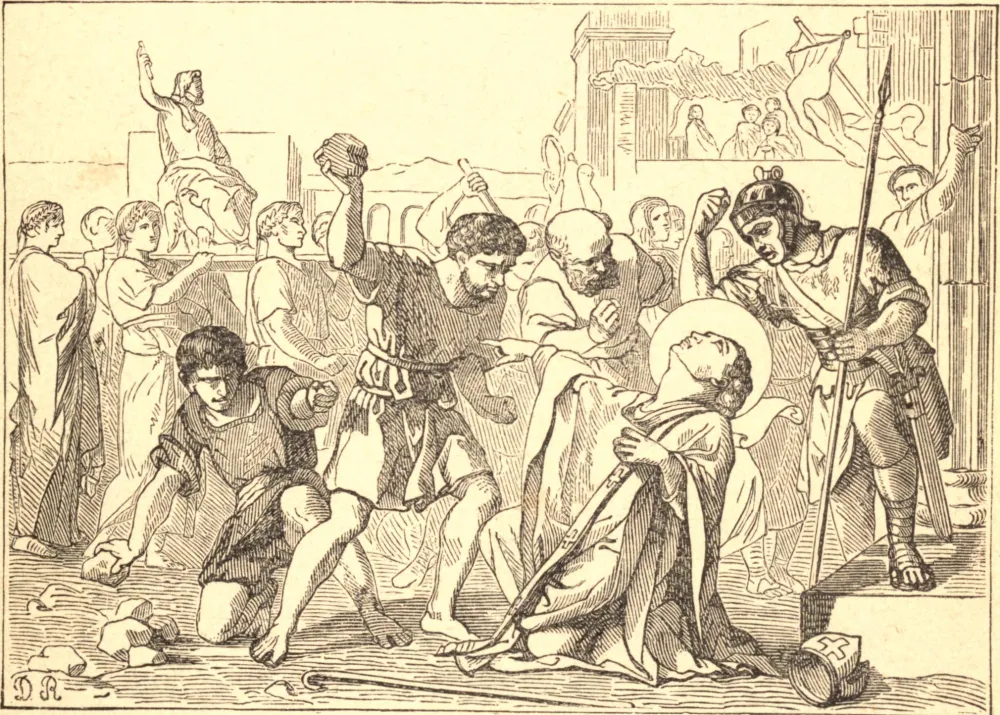

# 24 de janeiro — SÃO TIMÓTEO, Bispo, Mártir

TIMÓTEO foi um converso de São Paulo. Nasceu em Listra, na Ásia Menor. A sua mãe era judia, mas o seu pai era pagão; e, embora Timóteo tivesse lido as Escrituras desde a infância, não fora circuncidado como judeu. À chegada de São Paulo a Listra, o jovem Timóteo, com a sua mãe e a sua avó, abraçou ardentemente a fé. Sete anos depois, quando o Apóstolo visitou novamente a região, o menino se tornara homem, ao passo que o seu bom coração, as suas austeridades e o seu zelo lhe haviam granjeado a estima de todos ao seu redor; e homens santos profetizavam grandes coisas do fervoroso jovem. São Paulo logo viu a sua aptidão para a obra de evangelista. Timóteo foi imediatamente ordenado, e desde então tornou-se o constante e muito amado colaborador do Apóstolo. Em companhia de São Paulo, visitou as cidades da Ásia Menor e da Grécia — ora apressando-se à frente como mensageiro de confiança, ora demorando-se atrás para confirmar na fé alguma igreja recém-fundada. Por fim, foi feito o primeiro Bispo de Éfeso; e aqui recebeu as duas epístolas que levam o seu nome, a primeira escrita da Macedônia e a segunda de Roma, nas quais São Paulo, da sua prisão, dá vazão ao seu ardente desejo de ver o seu "filho muito amado", se possível, mais uma vez antes da sua morte. O próprio São Timóteo, não muitos anos após a morte de São Paulo, conquistou a sua coroa do martírio em Éfeso. Quando criança, Timóteo deleitava-se em ler os livros sagrados, e até a sua última hora recordaria as palavras de despedida do seu pai espiritual: "*Attende lectioni* — Aplica-te à leitura."

## Reflexão

São Paulo, ao escrever a Timóteo, servo fiel e bem provado de Deus, e bispo já entrado em anos, dirige-se a ele como a uma criança, e parece sumamente solícito quanto à sua perseverança na fé e na piedade. As cartas abundam em minuciosas instruções pessoais para esse fim. É, portanto, notável a grande ênfase que o Apóstolo põe em evitar a conversa ociosa, e na aplicação à leitura santa. Estes são os seus principais temas. Repetidas vezes exorta o seu filho Timóteo a "evitar os faladores e os intrometidos; a não dar atenção às novidades; a fugir das tagarelices profanas e vãs, mas a guardar a forma das sãs palavras; a ser um exemplo na palavra e na conversação; a aplicar-se à leitura, à exortação e à doutrina."
