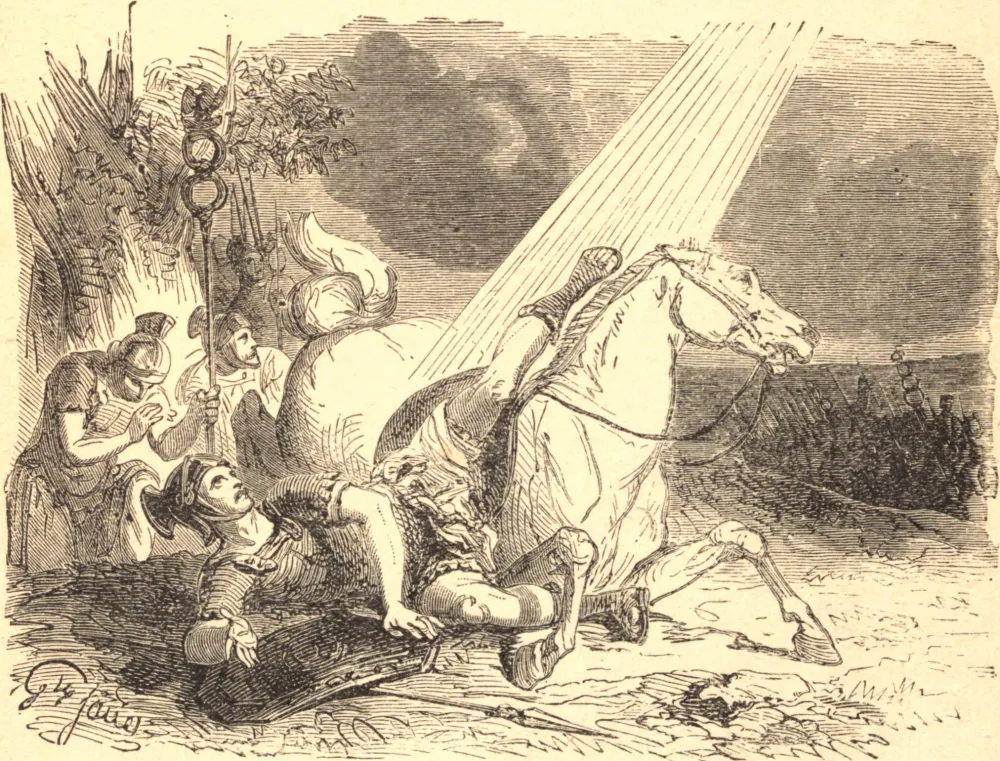

# 25 de janeiro — A CONVERSÃO DE SÃO PAULO

O grande apóstolo Paulo, chamado Saulo na sua circuncisão, nasceu em Tarso, capital da Cilícia, e era por privilégio cidadão romano, qualidade à qual as leis do império concediam grande distinção e várias isenções. Foi desde cedo instruído na estrita observância da lei mosaica, e a viveu da maneira mais escrupulosa. No seu zelo pela lei judaica, que julgava ser a causa de Deus, tornou-se violento perseguidor dos cristãos. Foi um dos que se conluiaram para assassinar Santo Estêvão, e na violenta perseguição dos fiéis que se seguiu ao martírio do santo diácono, Saulo distinguiu-se acima dos demais. Em virtude do poder que recebera do sumo sacerdote, arrancava os cristãos das suas casas, carregava-os de cadeias, e lançava-os na prisão. No furor do seu zelo, requereu uma comissão para prender todos os judeus em Damasco que confessassem Jesus Cristo, e trazê-los acorrentados a Jerusalém, para que servissem de exemplo aos demais. Mas Deus aprouve-se de manifestar nele a sua paciência e misericórdia. Enquanto seguia para Damasco, ele e a sua comitiva foram envolvidos por uma luz do céu, mais brilhante que o sol, e subitamente derrubados por terra. E então ouviu-se uma voz que dizia: "Saulo, Saulo, por que me persegues?" E Saulo respondeu: "Quem és Tu, Senhor?" e a voz replicou: "Eu sou Jesus, a Quem tu persegues." Esta branda admoestação de Nosso Redentor, acompanhada de uma poderosa graça interior, curou o orgulho de Saulo, aplacou a sua fúria, e operou de imediato uma total mudança nele. Por isso, trêmulo e atônito, exclamou: "Senhor, que queres que eu faça?" Nosso Senhor ordenou-lhe que se levantasse e prosseguisse o seu caminho para a cidade, onde seria informado do que dele se esperava. Saulo, levantando-se do chão, percebeu que, embora os seus olhos estivessem abertos, nada via. Foi conduzido pela mão a Damasco, onde foi hospedado na casa de um judeu chamado Judas. A esta casa veio, por desígnio divino, um homem santo chamado Ananias, que, impondo as mãos sobre Saulo, disse: "Irmão Saulo, o Senhor Jesus, que te apareceu na tua jornada, enviou-me para que recuperes a vista e sejas cheio do Espírito Santo." Imediatamente algo como escamas caiu dos olhos de Saulo, e ele recobrou a vista. Então levantou-se e foi batizado; permaneceu alguns dias com os discípulos em Damasco, e começou logo a pregar nas sinagogas que Jesus era o Filho de Deus. Assim, um blasfemo e perseguidor foi feito apóstolo, e escolhido como um dos principais instrumentos de Deus na conversão do mundo.

## Reflexão

Escuta as palavras da "Imitação de Cristo", e deixa que penetrem no teu coração: "Aquele que quiser conservar a graça de Deus, seja grato pela graça quando lhe é dada, e paciente quando lhe é retirada. Ore para que lhe seja devolvida, e seja cuidadoso e humilde, para não a perder."
