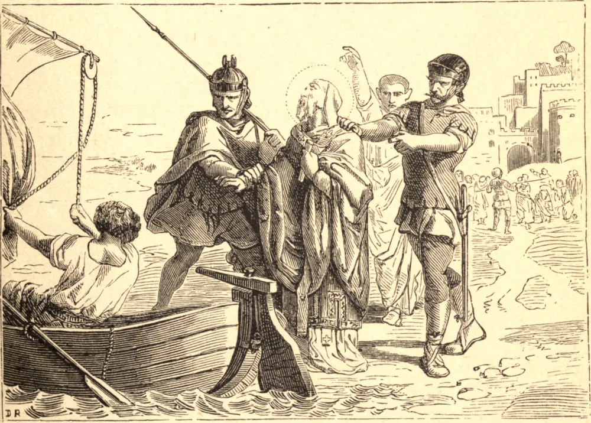

# 27 de janeiro — SÃO JOÃO CRISÓSTOMO

SÃO JOÃO nasceu em Antioquia em 344. A fim de romper com um mundo que o admirava e o cortejava, retirou-se, em 374, por seis anos, para uma montanha vizinha. Tendo assim adquirido a arte do silêncio cristão, retornou a Antioquia, e ali trabalhou como sacerdote, até ser ordenado Bispo de Constantinopla em 398. O efeito dos seus sermões era em toda parte maravilhoso. Insistia muito para que o seu povo frequentasse o santo sacrifício, e a fim de remover toda desculpa abreviou a longa Liturgia até então em uso. São Nilo relata que São João Crisóstomo costumava ver, quando o sacerdote começava o santo sacrifício, "muitos dos bem-aventurados descendo do céu em vestes resplandecentes, e de pés descalços, olhos atentos e cabeças inclinadas, em total quietude e silêncio, assistindo à consumação do tremendo mistério." Por mais amado que fosse em Constantinopla, as suas denúncias do vício lhe fizeram numerosos inimigos. Em 403, estes lhe procuraram o desterro; e, embora tenha sido quase imediatamente reconduzido, não foi mais do que um adiamento. Em 404 foi desterrado para Cucusus, nos desertos do Tauro. Em 407 ia se esgotando, mas os seus inimigos estavam impacientes. Apressaram-no rumo a Pytius, no Euxino, uma viagem áspera de quase 400 milhas. Foi assiduamente exposto a toda sorte de privações — frio, umidade e semi-inanição —, mas nada pôde vencer a sua alegria e a sua consideração pelos outros. Na viagem a sua enfermidade aumentou, e foi avisado de que o seu fim estava próximo. Então, trocando as suas roupas manchadas da viagem por vestes brancas, recebeu o Viático, e com as suas costumeiras palavras, "Glória seja dada a Deus por todas as coisas. Amém", passou para Cristo.

## Reflexão

Devemos procurar compreender que a obra mais produtiva de todo o dia, tanto para o tempo quanto para a eternidade, é aquela que está em ouvir a Missa. São João Crisóstomo sentia isto tão vivamente que não permitiu que nenhuma consideração de venerável costume interferisse na facilidade de ouvir a Missa.
