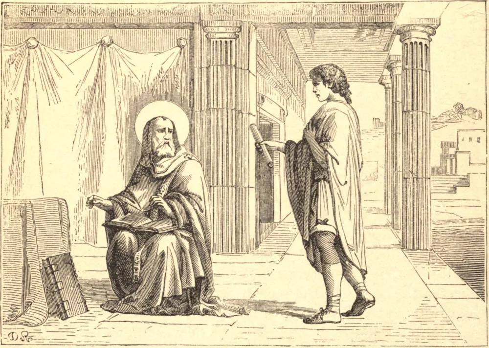

# 28 de janeiro — SÃO CIRILO DE ALEXANDRIA

SÃO CIRILO tornou-se Patriarca de Alexandria em 412. Tendo-se a princípio lançado com ardor nas políticas partidárias do lugar, Deus o chamou a um conflito mais nobre.

Em 428, Nestório, Bispo de Constantinopla, começou a negar a unidade de Pessoa em Cristo, e a recusar à Santíssima Virgem o título de "Mãe de Deus." Era fortemente apoiado por discípulos e amigos em todo o Oriente. Assim como a afirmação da maternidade divina de Nossa Senhora era necessária à integridade da doutrina da Encarnação, assim, para São Cirilo, a devoção à Mãe era o complemento necessário da sua devoção ao Filho. São Cirilo, depois de admoestar em vão, acusou Nestório ao Papa Celestino. O Papa ordenou a retratação, sob pena de separação da Igreja, e confiou a São Cirilo a condução do processo.

O dia designado, 7 de junho de 431, encontrou Nestório e Cirilo em Éfeso, com mais de 200 bispos. Após esperar doze dias em vão pelos bispos sírios, o concílio com Cirilo julgou Nestório, e o depôs da sua sé. Diante disso, os sírios e os nestorianos excomungaram São Cirilo, e queixaram-se dele ao imperador como perturbador da paz. Aprisionado e ameaçado de desterro, o Santo regozijou-se em confessar a Cristo pelo sofrimento. Com o tempo reconheceu-se que São Cirilo tinha razão, e com ele a Igreja triunfou. Esquecendo os seus agravos, e despreocupado com o pundonor da controvérsia, Cirilo então reconciliou-se com todos os que consentissem em manter intacta a doutrina da Encarnação. Morreu em 444.

**Reflexão**—A Encarnação é o mistério da habitação de Deus em nós, e por isso deve ser o objeto mais querido da nossa contemplação. Foi a paixão da vida de São Cirilo; por ela suportou labores e perseguições, e de bom grado sacrificou o crédito e os amigos.
