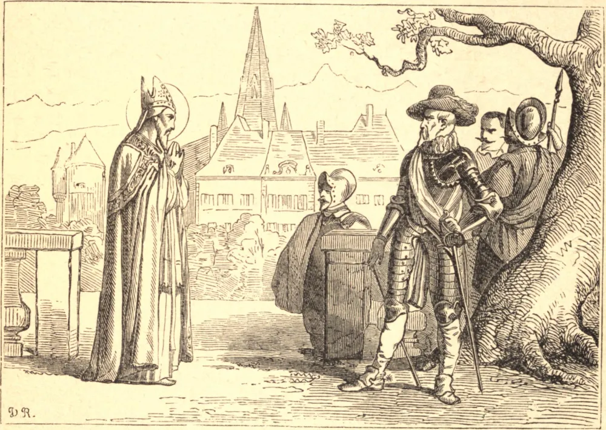

# 29 de janeiro — SÃO FRANCISCO DE SALES

FRANCISCO nasceu de pais nobres e piedosos, perto de Annecy, em 1566, e estudou com brilhante sucesso em Paris e Pádua. Ao regressar da Itália, abandonou a grandiosa carreira que o seu pai lhe traçara no serviço do Estado, e tornou-se sacerdote.

Quando o Duque de Saboia resolveu restaurar a Igreja no Chablais, Francisco ofereceu-se para a obra, e partiu a pé com a sua Bíblia e o seu breviário e um só companheiro, o seu primo Luís de Sales. Foi uma obra de labor, privação e perigo. Toda porta e todo coração se fechavam contra ele. Foi rejeitado com insultos e ameaçado de morte. Mas nada o pôde intimidar ou resistir, e em pouco tempo a Igreja irrompeu numa segunda primavera. Afirma-se que converteu 72.000 calvinistas.

Foi então compelido pelo Papa a tornar-se Bispo Coadjutor de Genebra, e sucedeu à sé em 1602. Por vezes a extrema brandura com que recebia os hereges e os pecadores quase escandalizava os seus amigos, e um deles lhe disse: "Francisco de Sales irá ao Paraíso, sem dúvida; mas não estou tão certo quanto ao Bispo de Genebra: receio quase que a sua brandura lhe pregue uma má peça." "Ah", disse o Santo, "eu preferiria prestar contas a Deus por uma brandura excessiva do que por uma severidade excessiva. Não é Deus todo amor? Deus Pai é o Pai das misericórdias; Deus Filho é um Cordeiro; Deus Espírito Santo é uma Pomba — isto é, a própria brandura. E serás tu mais sábio do que Deus?"

Em união com Santa Joana Francisca de Chantal, fundou em Annecy a Ordem da Visitação, que logo se espalhou pela Europa. Embora pobre, recusou provisões e dignidades, e até a grande sé de Paris. Morreu em Avinhão, em 1622.

**Reflexão**—"Apanharás mais moscas", costumava dizer São Francisco, "com uma colherada de mel do que com cem barris de vinagre. Se houvesse algo melhor ou mais belo na terra do que a brandura, Jesus Cristo no-lo teria ensinado; e, contudo, Ele nos deu apenas duas lições a aprender d'Ele — mansidão e humildade de coração."
