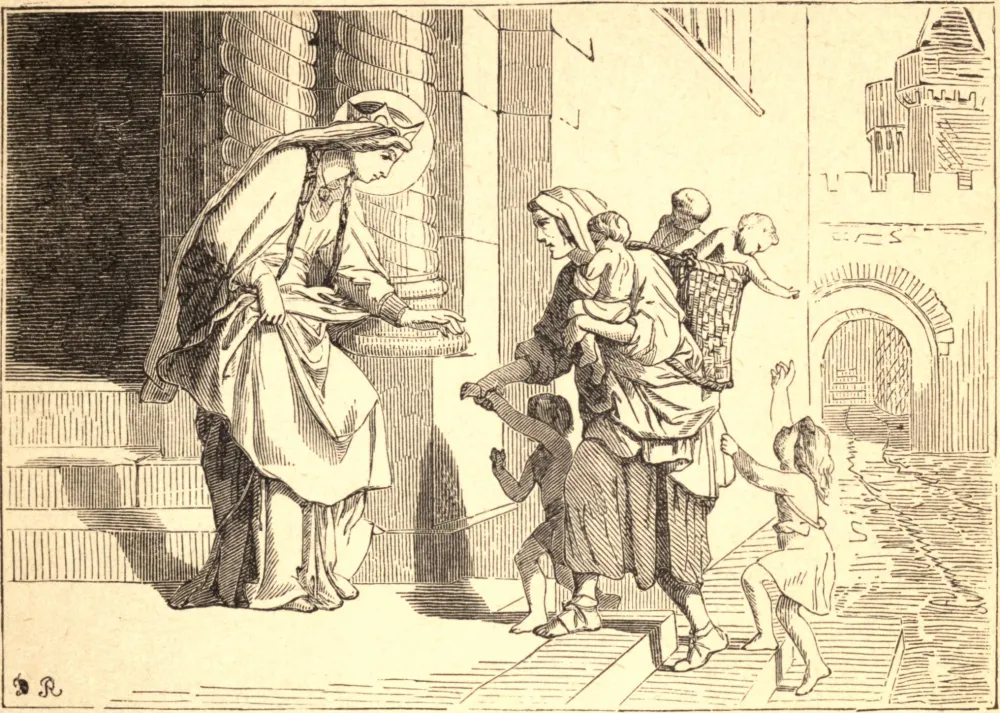

# 30 de janeiro — SANTA BATILDES, Rainha

SANTA BATILDES era uma inglesa que, ainda jovem, foi levada para a França, e ali vendida como escrava, a preço muito baixo, a Erkenwald, mordomo do palácio sob o Rei Clóvis II. Quando cresceu, o seu senhor ficou tão tomado pela sua prudência e virtude que a pôs à frente da sua casa. O renome das suas virtudes espalhou-se por toda a França, e o Rei Clóvis II a tomou por sua real consorte. Esta inesperada elevação não produziu alteração alguma num coração perfeitamente fundado na humildade e nas demais virtudes; parecia tornar-se ainda mais humilde do que antes. A sua nova condição lhe forneceu os meios de ser verdadeiramente uma mãe para os pobres; o rei deu-lhe a sanção da sua autoridade real para a proteção da Igreja, o cuidado dos pobres, e o fomento de todos os empreendimentos religiosos.

A morte do seu esposo a deixou regente do reino. Imediatamente proibiu a escravização dos cristãos, fez tudo o que estava ao seu alcance para promover a piedade, e encheu a França de hospitais e casas religiosas. Logo que o seu filho Clotário teve idade para governar, retirou-se do mundo e entrou no convento de Chelles. Aqui parecia esquecer inteiramente a sua dignidade mundana, e só se distinguia do resto da comunidade pela sua extrema humildade, pela sua obediência aos seus superiores espirituais, e pela sua devoção aos enfermos, a quem confortava e servia com maravilhosa caridade. Ao aproximar-se do seu fim, Deus a visitou com uma grave enfermidade, que suportou com paciência cristã até que, no dia 30 de janeiro de 680, entregou a sua alma em devota oração.

**Reflexão**—Em tudo o que fizermos, estejam sempre diante dos nossos olhos Deus e a sua santa vontade, e seja o nosso único intento e desejo agradar-Lhe.
