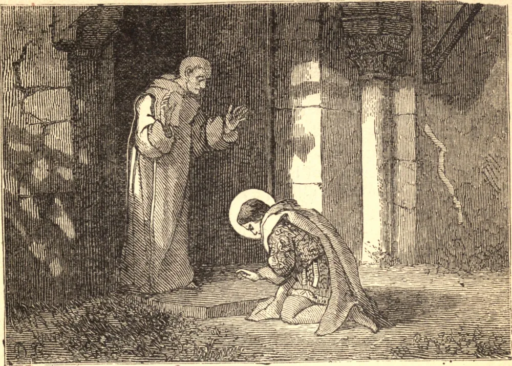

# 1 de julho — SÃO GALO, Bispo

SÃO GALO nasceu em Clermont, na Auvérnia, por volta do ano 489. Seu pai era de uma das primeiras casas daquela província, e sua mãe descendia da família de Vétio Apagato, o célebre romano que sofreu em Lião pela fé de Cristo. Ambos tomaram especial cuidado da educação do seu filho, e, quando ele chegou à idade própria, propuseram casá-lo com a filha de um respeitável senador.

O Santo, que tomara a resolução de consagrar-se a Deus, retirou-se em segredo da casa de seu pai para o mosteiro de Cournon, perto da cidade de Auvérnia, e fervorosamente suplicou ser admitido ali entre os monges; e, havendo logo depois obtido o consentimento de seus pais, com alegria renunciou a todas as vaidades mundanas para abraçar a pobreza religiosa. Aqui as suas eminentes virtudes o distinguiram de modo particular, e o recomendaram a Quintiano, Bispo de Auvérnia, que o promoveu às ordens sacras. Morrendo o bispo em 527, São Galo foi designado para sucedê-lo, e neste novo caráter a sua humildade, a sua caridade e o seu zelo foram notáveis; acima de tudo, a sua paciência em suportar injúrias.

Sendo certa vez golpeado na cabeça por um homem brutal, não revelou a menor emoção de ira ou ressentimento, e por esta mansidão desarmou o selvagem do seu furor. Em outra ocasião, Evódio, que de senador se tornara sacerdote, havendo-se esquecido de si a ponto de tratá-lo do modo mais insultante, o Santo, sem dar a menor resposta, levantou-se mansamente do seu assento e foi visitar as igrejas da cidade. Evódio ficou tão tocado por esta conduta que se lançou aos pés do Santo, no meio da rua, e lhe pediu perdão. Desde este tempo, ambos viveram em termos da mais cordial amizade. São Galo foi favorecido com o dom dos milagres, e morreu por volta do ano 553.
