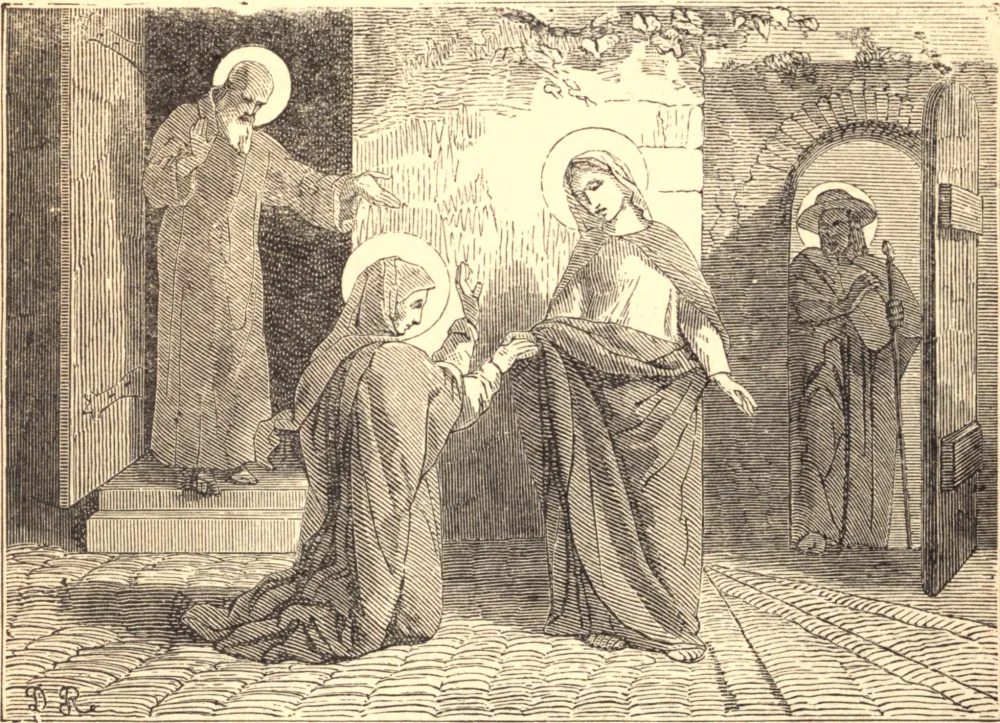

# 2 de julho — A VISITAÇÃO DA SANTÍSSIMA VIRGEM

O anjo Gabriel, no mistério da Anunciação, informou à Mãe de Deus que sua prima Isabel havia concebido milagrosamente, e estava então grávida de um filho que haveria de ser o precursor do Messias. A Santíssima Virgem, por humildade, ocultava a maravilhosa dignidade à qual fora elevada pela encarnação do Filho de Deus em seu ventre, mas, no arrebatamento de sua santa alegria e gratidão, decidiu que iria felicitar a mãe do Batista.

"Levantou-se, pois, Maria," diz São Lucas, "e foi apressadamente à região montanhosa, a uma cidade de Judá, e, entrando na casa de Zacarias, saudou Isabel." Que bênção trouxe a presença do Deus-homem a esta casa, a primeira que Ele honrou em sua humanidade com a sua visita! Mas Maria é o instrumento e o meio pelo qual Ele lhe comunica a sua divina bênção, para mostrar-nos que ela é um canal por meio do qual Ele se compraz em comunicar-nos as suas graças, e para nos encorajar a pedi-las a Ele por sua intercessão.

À voz da Mãe de Deus, mas pelo poder e pela graça de seu divino Filho em seu ventre, Isabel foi cheia do Espírito Santo, e o Infante em seu ventre concebeu tão grande alegria a ponto de saltar e exultar. Ao mesmo tempo Isabel foi cheia do Espírito Santo, e por sua luz infundida compreendeu o grande mistério da Encarnação que Deus havia operado em Maria, a quem a humildade impedia de revelá-lo mesmo a uma Santa, e amiga íntima. Em arrebatamentos de assombro, Isabel a proclamou bendita acima de todas as outras mulheres, e exclamou: "De onde me vem isto, que a mãe do meu Senhor venha a mim?" Maria, ouvindo o seu próprio louvor, mergulhou ainda mais fundo no abismo do seu nada, e no arrebatamento de sua humildade, derretendo-se num êxtase de amor e gratidão, irrompeu naquele admirável cântico, o *Magnificat*. Maria permaneceu com sua prima quase três meses, após o que regressou a Nazaré.

**Reflexão**—Enquanto, com a Igreja, louvamos a Deus pelas misericórdias e maravilhas que Ele operou neste mistério, devemos aplicar-nos à imitação das virtudes das quais Maria nos dá um perfeito exemplo. Dela devemos particularmente aprender as lições pelas quais santificaremos nossas visitas e conversações, ações que são, para tantos cristãos, fontes de inumeráveis perigos e pecados.
