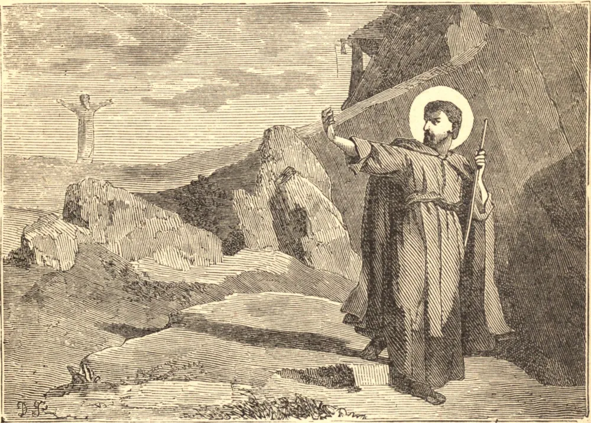

# 3 de julho — SANTO HELIODORO, Bispo

Este Santo nasceu na Dalmácia, terra natal de São Jerônimo, e logo procurou aquele grande Doutor, a fim de não só seguir seus conselhos em matérias relativas à perfeição cristã, mas também aproveitar-se de sua profunda erudição. A vida de recluso possuía atrativos peculiares para ele, mas, para entrar num mosteiro, seria necessário deixar seu mestre e diretor espiritual, e tal sacrifício ele não estava preparado para fazer. Permaneceu no mundo, embora não fosse do mundo, e, seguindo o exemplo dos santos anacoretas, passava seu tempo em oração e leitura devota.

Acompanhou São Jerônimo ao Oriente, mas o desejo de revisitar sua terra natal, e de ver seus pais mais uma vez, atraiu-o de volta à Dalmácia, embora São Jerônimo procurasse persuadi-lo a permanecer. Prometeu retornar assim que cumprisse o dever que devia a seus pais. Entrementes, vendo que sua ausência se prolongava, e temendo que o amor à família e o apego às coisas mundanas pudessem desviá-lo de sua vocação, São Jerônimo escreveu-lhe uma carta fervorosa, exortando-o a romper inteiramente com o mundo e a consagrar-se ao serviço de Deus.

Mas o Senhor, que dispõe todas as coisas, tinha outra missão para o seu servo. Após a morte de sua mãe, Heliodoro foi para a Itália, onde logo se tornou notável por sua eminente piedade. Foi feito Bispo de Altino, e tornou-se um dos mais distintos prelados de uma época fecunda em grandes homens. Morreu por volta do ano 290.
