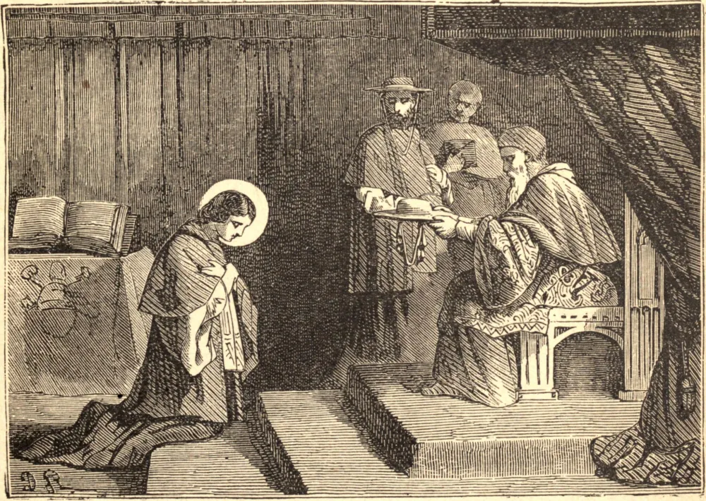

# 5 de julho — SÃO PEDRO DE LUXEMBURGO

Pedro de Luxemburgo, descendente tanto por parte de pai como de mãe das mais nobres famílias da Europa, nasceu na Lorena, no ano de 1369. Quando ainda não passava de um estudante de doze anos de idade, foi para Londres como refém de seu irmão, o Conde de St. Pol, que havia sido feito prisioneiro. Os ingleses ficaram de tal modo conquistados pelo santo exemplo de Pedro, que o libertaram ao fim de um ano, fiando-se em sua palavra quanto ao resgate. Ricardo II convidou-o então a permanecer na corte inglesa; mas Pedro regressou a Paris, decidido a não ter outro senhor senão Cristo.

Na tenra idade de quinze anos foi nomeado, em razão de sua prudência e santidade, Bispo de Metz, e fez sua entrada pública em sua sé descalço e montado num jumento. Governou sua diocese com todo o zelo e a prudência da maturidade, e dividiu suas rendas em três partes — para a Igreja, para os pobres, e para sua casa. Suas caridades muitas vezes o deixavam pessoalmente na indigência, e tinha apenas vinte moedas quando morreu. Criado Cardeal de São Jorge, suas austeridades em meio a uma corte eram tão severas que lhe ordenaram moderá-las. Pedro respondeu: "Serei sempre um servo inútil, mas ao menos posso obedecer."

Dez meses após sua promoção, caiu enfermo de uma febre, e definhou por algum tempo num estado decadente, sua santidade aumentando à medida que se aproximava do fim. São Pedro, acreditava-se, jamais manchou a alma com pecado mortal; contudo, à medida que crescia em graça, seu santo ódio a si mesmo tornava-se cada vez mais intenso. Por fim, depois de ter recebido os últimos sacramentos, forçou seus assistentes, cada um por sua vez, a flagelá-lo por suas faltas, e então jazeu em silêncio até morrer.

Mas Deus se comprouve em glorificar o seu servo. Entre outros milagres, está o seguinte: a 5 de julho de 1432, uma criança de cerca de doze anos de idade morreu ao cair de uma alta torre, no palácio de Avinhão, sobre uma rocha pontiaguda. O pai, transtornado de dor, recolheu os pedaços dispersos do crânio e dos miolos, e levou-os num saco, junto com o corpo mutilado de seu filho, ao santuário de São Pedro, e com muitas lágrimas implorou a intercessão do Santo. Após algum tempo, a criança voltou à vida, e foi colocada sobre o altar para que todos testemunhassem. Em honra deste milagre, a cidade de Avinhão escolheu São Pedro como seu Santo padroeiro. Morreu em 1387, com dezoito anos de idade.

**Reflexão**—São Pedro nos ensina como, pela abnegação, a posição, as riquezas, as mais altas dignidades, e tudo o que este mundo pode dar, podem servir para fazer um Santo.
