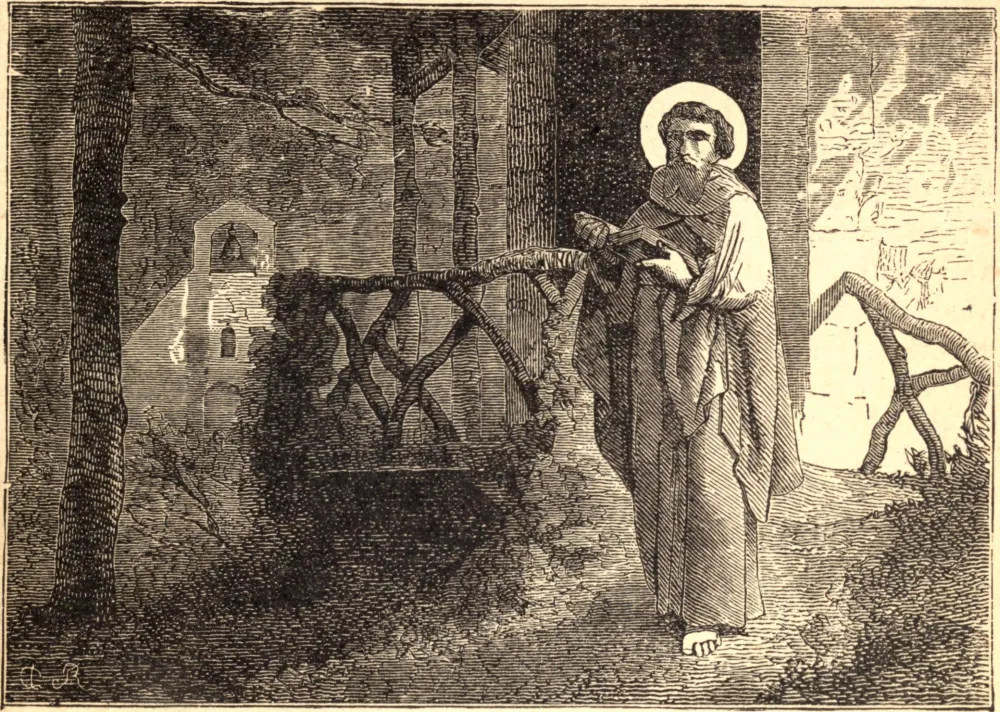

# 6 de julho — SÃO GOAR, Sacerdote

São Goar nasceu de uma ilustre família, na Aquitânia. Desde sua juventude foi notável por sua fervorosa piedade, e, tendo sido elevado às ordens sagradas, converteu muitos pecadores pelo fervor de sua pregação e pela força de seu exemplo.

Desejando servir a Deus inteiramente desconhecido do mundo, passou à Germânia, e, estabelecendo-se nas vizinhanças de Trier, fechou-se em sua cela, e chegou a tão eminente grau de santidade que era tido por oráculo e milagre de toda a região.

Sigeberto, Rei da Austrásia, ao tomar conhecimento da santidade de Goar, quis tê-lo feito Bispo de Metz, e para esse fim convocou-o à corte. O Santo, temendo as responsabilidades do ofício, rogou que dele fosse dispensado. Foi acometido de uma febre, e morreu em 575.
