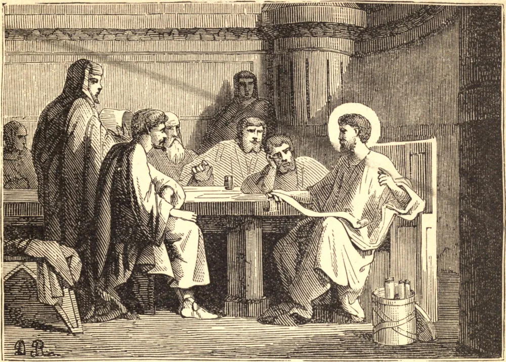

# 7 de julho — SÃO PANTENO, Padre da Igreja

Este erudito padre e varão apostólico floresceu no segundo século. Era siciliano de nascimento, e filósofo estoico de profissão. Sua estima pela virtude o conduziu a um trato com os cristãos, e, ficando encantado com a inocência e a santidade de sua conversação, abriu os olhos para a verdade.

Estudou as Sagradas Escrituras sob os discípulos dos apóstolos, e sua sede de saber sagrado trouxe-o a Alexandria, no Egito, onde os discípulos de São Marcos haviam instituído uma célebre escola de doutrina cristã. Panteno não procurou ostentar seus talentos naquele grande empório de literatura e comércio; mas este grande progresso no saber sagrado foi, depois de algum tempo, descoberto, e ele foi tirado daquela obscuridade na qual sua humildade buscava sepultar-se. Colocado à frente da escola cristã algum tempo antes do ano 179, por sua erudição e excelente maneira de ensinar elevou-lhe a reputação acima de todas as escolas dos filósofos, e as lições que ministrava, e que eram colhidas das flores dos profetas e dos apóstolos, transmitiam luz e conhecimento às mentes de todos os seus ouvintes.

Os indianos que comerciavam em Alexandria suplicaram-lhe que visitasse seu país, ao que ele abandonou sua escola e foi pregar o Evangelho às nações do Oriente. São Panteno encontrou algumas sementes da fé já lançadas nas Índias, e um livro do Evangelho de São Mateus em hebraico, que São Bartolomeu havia levado para lá. Trouxe-o consigo de volta a Alexandria, para onde regressou depois de haver zelosamente empregado alguns anos em instruir os indianos na fé. São Panteno continuou a ensinar em particular até por volta do ano 216, quando encerrou uma nobre e excelente vida com uma feliz morte.

**Reflexão**—"Tomai cuidado para que ninguém vos engane com uma falsa filosofia," diz São Paulo, pois a filosofia sem religião é coisa vã.
