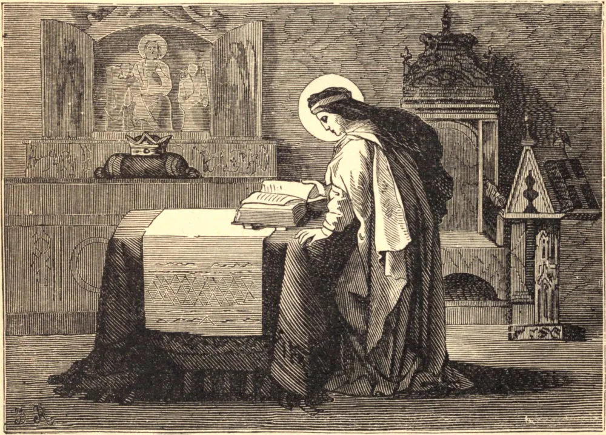

# 8 de julho — SANTA ISABEL DE PORTUGAL

Isabel nasceu em 1271. Era filha de Pedro III de Aragão, e recebeu o nome de sua tia, Santa Isabel da Hungria. Aos doze anos de idade foi dada em casamento a Diniz, Rei de Portugal, e, de santa criança, tornou-se uma esposa santa. Ouvia Missa e recitava o Ofício Divino diariamente, mas suas devoções eram dispostas com tal prudência que não interferiam em nenhum dever de seu estado. Preparava-se para suas frequentes comunhões com severas austeridades, jejuando três vezes por semana, e com heroicas obras de caridade.

Foi chamada por diversas vezes a fazer as pazes entre seu marido e seu filho Afonso, que havia pegado em armas contra ele. Seu marido a provou muito, tanto por seu ciúme infundado como por sua infidelidade para com ela. Uma calúnia que envolvia Isabel e um de seus pajens fez o rei resolver matar o jovem, e ele disse a um caieiro que lançasse em seu forno o primeiro pajem que chegasse com uma mensagem real. No dia fixado, o pajem foi enviado; mas o rapaz, que tinha por hábito ouvir Missa diariamente, deteve-se a caminho para fazê-lo. O rei, em suspense, enviou um segundo pajem, o próprio autor da calúnia, o qual, chegando primeiro ao forno, foi imediatamente lançado na fornalha e queimado. Pouco depois, o primeiro pajem chegou da igreja, e levou de volta ao rei a resposta do caieiro de que suas ordens haviam sido cumpridas. Assim, ouvir Missa salvou a vida do pajem e provou a inocência da rainha.

Sua paciência, e a maravilhosa doçura com que chegava a acalentar os filhos de suas rivais, conquistaram inteiramente o rei de seus maus caminhos, e ele tornou-se um marido devotado e um rei verdadeiramente cristão. Edificou muitas instituições de caridade e casas religiosas, entre outras um convento de Clarissas Pobres. Após a morte de seu marido, desejou entrar em sua Ordem; mas, dissuadida por seu povo, que não podia passar sem ela, tomou o hábito da Terceira Ordem de São Francisco, e passou o resto de sua vida em austeridades redobradas e em esmolas. Morreu aos sessenta e cinco anos, enquanto estava no ato de fazer as pazes entre seus filhos.

**Reflexão**—No Santo Sacrifício do Altar, Santa Isabel encontrava diariamente forças para suportar com doçura a suspeita e a crueldade; e por esse mesmo Santo Sacrifício foi provada a sua inocência. Que socorro perdemos pela negligência da Missa diária!
