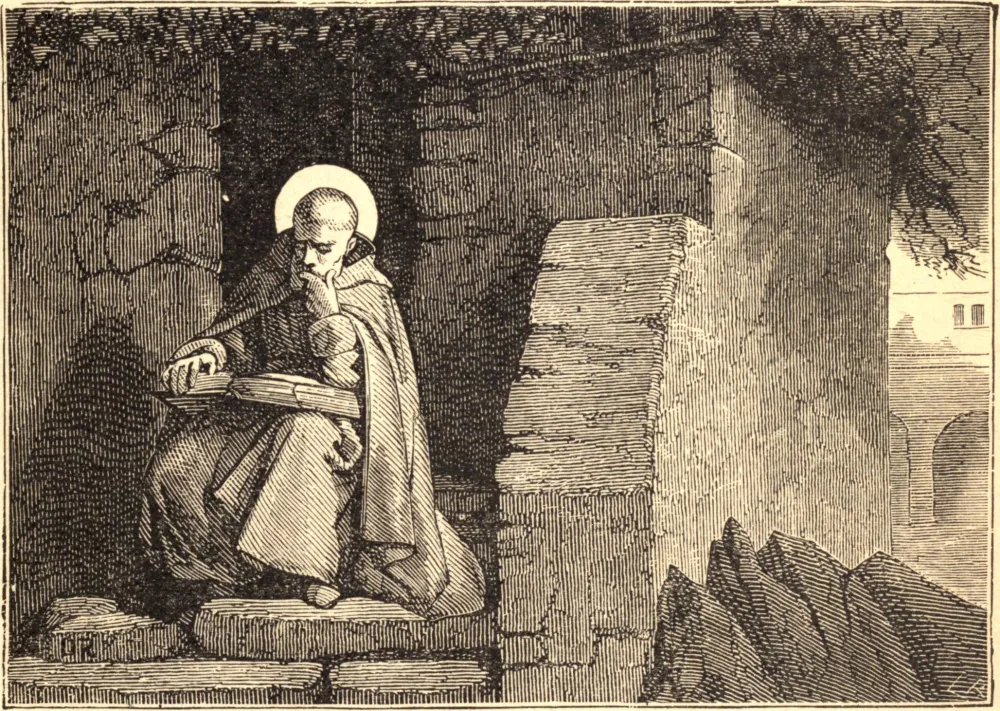

# 9 de julho — SANTO EFRÉM, Diácono

Santo Efrém é a luz e a glória da Igreja Siríaca. Ainda um simples jovem, entrou na vida religiosa em Nísibis, sua terra natal. Longos anos de retiro ensinaram-lhe a ciência dos Santos, e então Deus o chamou a Edessa, para ali ensinar o que tão bem havia aprendido. Defendeu a Fé contra as heresias, em livros que o tornaram conhecido como o Profeta dos Sírios. Multidões pendiam de suas palavras. As lágrimas costumavam deter-lhe a voz quando pregava. Tremia, e fazia tremer seus ouvintes, ao pensamento dos juízos de Deus; mas encontrava na compunção e na humildade o caminho para a paz, e repousava com inabalável confiança na misericórdia de nosso bendito Senhor. "Estou partindo," diz ele, falando de sua própria morte, "estou partindo para uma viagem dura e perigosa. A Ti, ó Filho de Deus, tomei por meu Viático. Quando tiver fome, alimentar-me-ei de Ti. O fogo infernal não ousará aproximar-se de mim, pois não pode suportar a fragrância do Teu Corpo e do Teu Sangue." Seus hinos conquistaram os corações do povo, expulsaram os hinos dos hereges gnósticos, e granjearam-lhe o título que ostenta na Liturgia Siríaca até hoje — "a Harpa do Espírito Santo." Apaixonado como era por natureza, desde o tempo em que entrou na religião ninguém jamais o viu irado. Abundante em labores até o último momento, trabalhou pelos pobres que sofriam em Edessa na fome de 378, e ali se deitou para morrer em extrema velhice. Qual foi o segredo de um êxito tão variado e tão completo? A humildade, que o fazia desconfiar de si mesmo e confiar em Deus. Até sua morte, chorou pelos pecados leves cometidos na irreflexão da meninice. Recusou a dignidade do sacerdócio. "Eu," disse a São Basílio, a quem fora ver por ordem do Espírito Santo, "eu sou aquele Efrém que se desviou do caminho do céu." Então, irrompendo em lágrimas, exclamou: "Ó meu pai, tem piedade de um pobre pecador, e conduze-me pela vereda estreita."

## Reflexão

A humildade é a vereda que conduz à paz duradoura e nos aproxima das consolações de Deus.
