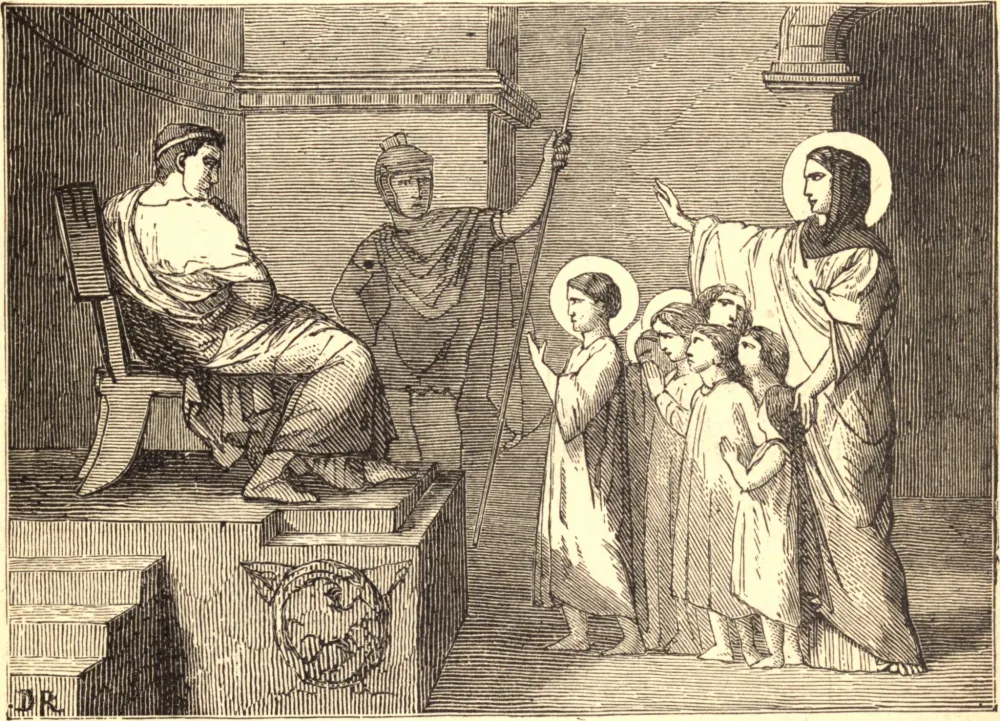

# 10 de julho — OS SETE IRMÃOS, Mártires, e SANTA FELICIDADE, sua Mãe

O ilustre martírio destes Santos sucedeu em Roma, sob o Imperador Antonino. Os sete irmãos eram filhos de Santa Felicidade, uma nobre, piedosa e cristã viúva em Roma, que, após a morte de seu marido, serviu a Deus num estado de continência e se ocupou inteiramente em oração, jejum e obras de caridade. Pelo público e edificante exemplo desta senhora e de toda a sua família, muitos idólatras foram movidos a renunciar ao culto de seus falsos deuses, e a abraçar a Fé de Cristo.

Isto excitou a ira dos sacerdotes pagãos, que se queixaram ao imperador de que a ousadia com que Felicidade praticava publicamente a religião cristã afastava muitos do culto dos deuses imortais, que eram os guardiães e protetores do império, e que, a fim de aplacar esses falsos deuses, era necessário compelir esta senhora e seus filhos a sacrificar-lhes. Públio, o prefeito de Roma, mandou prender a mãe e seus filhos e trazê-los à sua presença, e, dirigindo-se a ela, disse: "Tem piedade de teus filhos, Felicidade; estão na flor da juventude, e podem aspirar às maiores honras e distinções." A santa mãe respondeu: "Tua piedade é, na verdade, impiedade, e a compaixão à qual me exortas faria de mim a mais cruel das mães." Então, voltando-se para os seus filhos, disse-lhes: "Meus filhos, olhai para o céu, onde Jesus Cristo com Seus Santos vos espera. Sede fiéis no Seu amor, e lutai corajosamente por vossas almas."

Públio, exasperado com este comportamento, ordenou que ela fosse cruelmente esbofeteada; em seguida chamou os filhos a si, um após outro, e usou de muitos discursos ardilosos, misturando promessas com ameaças para induzi-los a adorar os deuses. Seus argumentos e ameaças foram igualmente em vão, e os irmãos foram condenados a ser açoitados. Depois de açoitados, foram reconduzidos à prisão, e o prefeito, desesperando de vencer a sua resolução, expôs todo o processo ao imperador. Antonino deu ordem para que fossem enviados a diferentes juízes, e condenados a diferentes mortes.

Januário foi açoitado até a morte com chicotes carregados de bolas de chumbo. Os dois seguintes, Félix e Filipe, foram espancados com clavas até expirarem. Silvano, o quarto, foi atirado de cabeça por um íngreme precipício. Os três mais jovens, Alexandre, Vital e Marcial, foram decapitados, e a mesma sentença foi executada na mãe quatro meses depois.

**Reflexão**—Que aflições os pais encontram diariamente nas desordens em que seus filhos caem por seu próprio mau exemplo ou negligência! Imitem eles o empenho de Santa Felicidade em formar para a perfeita virtude as tenras almas que Deus confiou aos seus cuidados, e com esta Santa terão nelas o maior de todos os consolos, e, por Sua graça, contarão em sua família tantos Santos quantos forem os filhos com que são abençoados.
