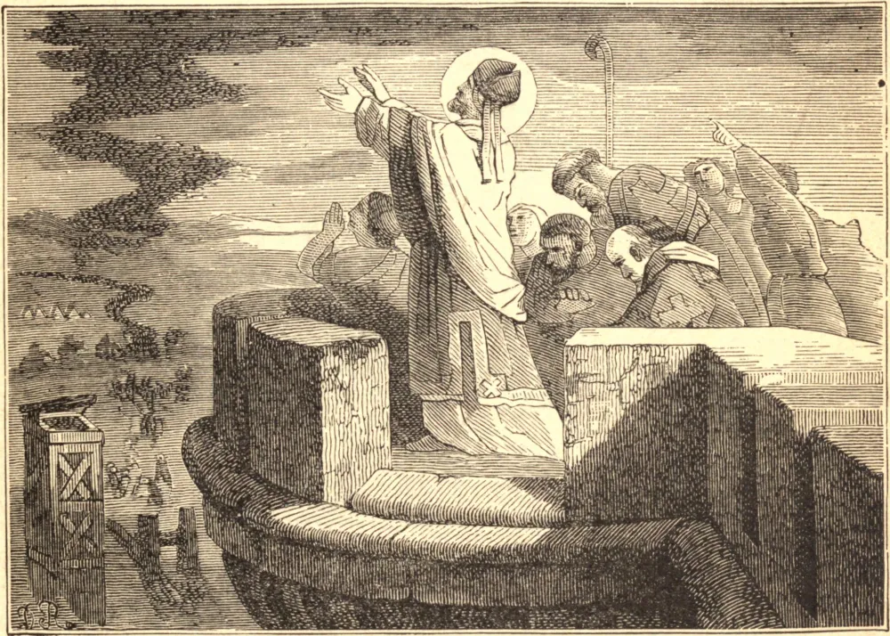

# 11 de julho — SÃO TIAGO, Bispo

Este eminente Santo e glorioso Doutor da Igreja Siríaca era natural de Nísibis, na Mesopotâmia. Em sua juventude, ao entrar no mundo, tremeu à vista de seus vícios e do caminho escorregadio de seus prazeres, e julgou ser a parte mais segura fortalecer-se no retiro, para que depois pudesse melhor manter sua posição no campo de batalha. Escolheu por isso a mais alta montanha para sua morada, abrigando-se numa caverna no inverno, e o resto do ano vivendo nos bosques, continuamente exposto ao ar livre. Não obstante seu desejo de viver desconhecido dos homens, foi descoberto, e muitos não temeram escalar as escarpadas rochas para se recomendarem às suas orações e receberem o conforto de seu conselho espiritual. Foi favorecido com os dons da profecia e dos milagres em medida incomum. Certo dia, quando viajava, foi abordado por um bando de mendigos, com o intuito de extorquir-lhe dinheiro sob o pretexto de enterrar seu companheiro, que jazia estendido no chão como se estivesse morto. O santo homem deu-lhes o que pediam, e "elevando súplicas a Deus como por uma alma que partira, rogou que Sua Divina Majestade lhe perdoasse os pecados que cometera enquanto vivo, e que o admitisse na companhia dos Santos." Tão logo o Santo passou adiante, os mendigos, chamando seu companheiro para que se levantasse e tomasse a sua parte do espólio, surpreenderam-se ao encontrá-lo realmente morto. Tomados de súbito temor e dor, gritaram na maior consternação, e imediatamente correram atrás do homem de Deus, lançaram-se a seus pés, confessaram o embuste, suplicaram perdão, e rogaram-lhe que, por suas orações, restituísse à vida o seu infeliz companheiro, o que o Santo fez. O mais famoso milagre de nosso Santo foi aquele pelo qual protegeu sua cidade natal dos bárbaros. Sapor II, o altivo Rei da Pérsia, sitiou Nísibis com toda a força de seu império, enquanto nosso Santo era Bispo. O Bispo não quis orar pela destruição de ninguém, mas implorou a Divina Misericórdia que a cidade fosse libertada das calamidades de um cerco tão longo. Depois, subindo ao topo de uma alta torre, e voltando o rosto para o inimigo, e vendo a prodigiosa multidão de homens e animais que cobria todo o país, disse: "Senhor, és capaz, pelos mais fracos meios, de humilhar a soberba dos Teus inimigos; derrota estas multidões por um exército de mosquitos." Deus ouviu a humilde oração de Seu servo. Mal o Santo havia proferido essas palavras, quando nuvens inteiras de mosquitos e moscas vieram precipitar-se sobre os persas, entraram nas trombas dos elefantes e nas orelhas e narinas dos cavalos, o que os fez agitar-se e espumar, atirar seus cavaleiros, e lançar todo o exército em confusão e desordem. Uma fome e uma peste, que se seguiram, levaram grande parte do exército; e Sapor, depois de jazer mais de três meses diante do lugar, pôs fogo a todas as suas próprias máquinas de guerra, e foi forçado a abandonar o cerco e regressar a casa com a perda de vinte mil homens. Sapor sofreu um terceiro revés sob os muros de Nísibis, em 359, após o que voltou suas armas contra Amida, tomou aquela forte cidade, e passou ao fio da espada a guarnição e a maior parte dos habitantes. Os cidadãos de Nísibis atribuíram sua preservação à intercessão de seu glorioso padroeiro, São Tiago, embora ele já tivesse ido para a sua recompensa. Morreu em 350.
