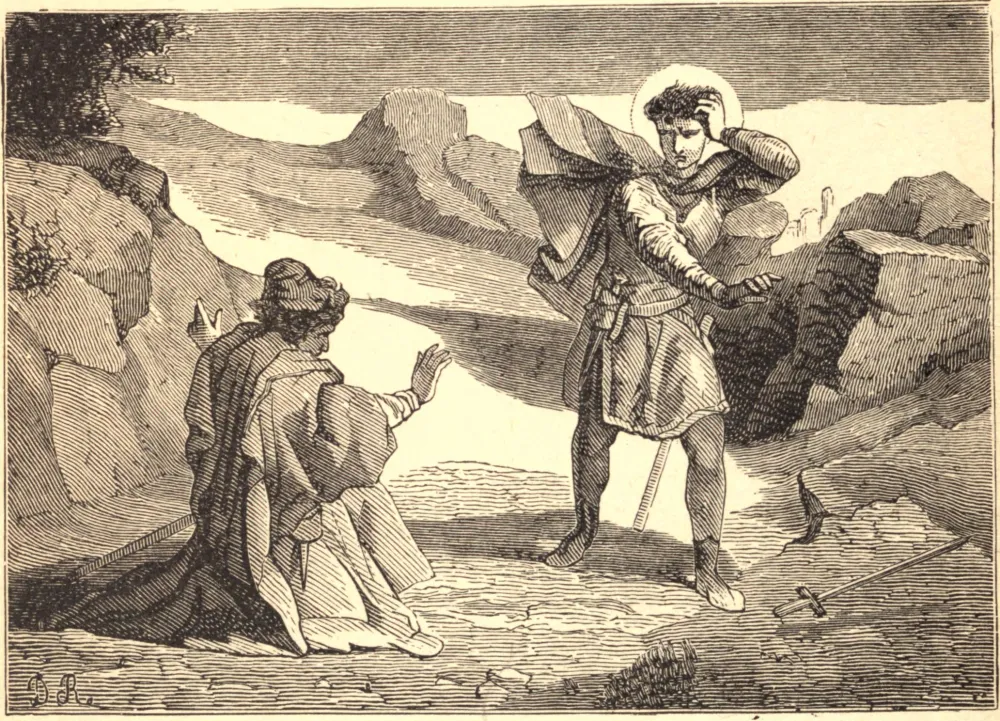

# 12 de julho — SÃO JOÃO GUALBERTO

São João Gualberto nasceu em Florença, no ano de 999 d.C. Seguindo a profissão das armas naquele período conturbado, viu-se envolvido numa rixa sangrenta com um parente próximo. Numa Sexta-feira Santa, quando cavalgava para dentro de Florença acompanhado de homens armados, encontrou seu inimigo num lugar onde nenhum dos dois podia evitar o outro. João o teria matado; mas seu adversário, que estava totalmente despreparado para lutar, caiu de joelhos com os braços estendidos em forma de cruz, e implorou-lhe, pela santa Paixão de Nosso Senhor, que lhe poupasse a vida. São João disse a seu inimigo: "Não posso recusar o que pedes em nome de Cristo. Concedo-te a vida, e dou-te a minha amizade. Ora para que Deus me perdoe o meu pecado." A graça triunfou. Homem humilde e transformado, entrou na Igreja de São Miniato, que ficava próxima; e, enquanto orava, a figura de nosso Senhor crucificado, diante da qual estava ajoelhado, inclinou a cabeça em sua direção, como que para ratificar seu perdão. Abandonando o mundo, entregou-se à oração e à penitência na Ordem Beneditina. Mais tarde foi levado a fundar a congregação chamada de Vallombrosa, do vale sombreado a poucas milhas de Florença, onde estabeleceu seu primeiro mosteiro. Certa vez, os inimigos do Santo vieram ao seu convento de São Salvi, saquearam-no, e atearam-lhe fogo, e, tendo tratado os monges com ignomínia, espancaram-nos e feriram-nos. São João regozijou-se. "Agora," disse ele, "sois verdadeiros monges. Quem dera eu mesmo tivesse tido a honra de estar convosco quando os soldados vieram, para que tivesse tido uma parte na glória de vossas coroas!" Lutou virilmente contra a simonia, e de muitos modos promoveu o interesse da Fé na Itália. Após uma vida de grande austeridade, morreu enquanto os anjos cantavam ao redor de seu leito, a 11 de julho de 1073.

## Reflexão

O ato heroico que mereceu para São João Gualberto sua conversão foi o perdão de seu inimigo. Imitemo-lo nesta virtude, resolvendo nunca nos vingar por ato, por palavra, ou por pensamento.
