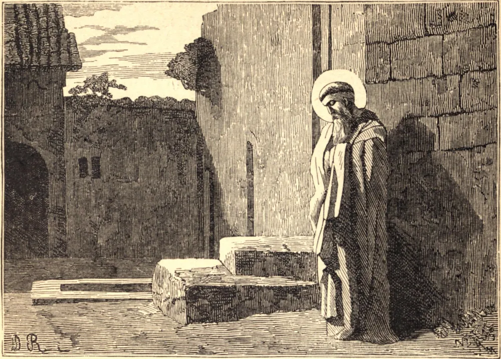

# 13 de julho — SÃO EUGÊNIO, Bispo

A sé episcopal de Cartago havia permanecido vaga por vinte e quatro anos quando, em 481, Hunerico permitiu aos católicos, sob certas condições, escolherem alguém que a ocupasse. O povo, impaciente por gozar do conforto de um pastor, escolheu Eugênio, cidadão de Cartago, eminente por sua erudição, zelo, piedade e prudência. Suas caridades para com os aflitos eram excessivas, e ele privava-se de tudo para que pudesse dar tudo aos pobres.

Sua virtude granjeou-lhe o respeito e a estima até dos arianos; mas por fim a inveja e o zelo cego prevaleceram em seus corações, e o rei enviou-lhe uma ordem para nunca se assentar no trono episcopal, pregar ao povo, ou admitir em sua capela quaisquer vândalos, entre os quais vários eram católicos. O Santo respondeu ousadamente que as leis de Deus lhe ordenavam não fechar a porta de Sua igreja a nenhum que desejasse servi-Lo nela. Hunerico, enfurecido com esta resposta, perseguiu os católicos de várias maneiras. Muitas freiras foram tão cruelmente torturadas que morreram no potro. Grandes números de bispos, sacerdotes, diáconos e eminentes leigos católicos foram banidos para um deserto repleto de escorpiões e serpentes venenosas.

O povo seguia seus bispos e sacerdotes com velas acesas nas mãos, e as mães carregavam seus pequeninos nos braços e os depositavam aos pés dos confessores, todos clamando entre lágrimas: "Indo vós mesmos para as vossas coroas, a quem nos deixais? Quem batizará nossos filhos? Quem nos comunicará o benefício da penitência, e nos libertará dos laços do pecado pelo favor da reconciliação e do perdão? Quem nos sepultará com solenes súplicas em nossa morte? Por quem será feito o Divino Sacrifício?"

O Bispo Eugênio foi poupado na primeira tempestade, mas depois foi levado à desabitada região desértica da província de Trípolis, e confiado à guarda de Antônio, um desumano bispo ariano, que o tratou com a maior barbárie. Gontamundo, que sucedeu a Hunerico, chamou de volta nosso Santo a Cartago, abriu as igrejas católicas e permitiu que todos os sacerdotes exilados regressassem. Após reinar doze anos, Gontamundo morreu, e seu irmão Trasimundo foi chamado à coroa. Sob este príncipe, São Eugênio foi novamente banido, e morreu no exílio, no dia 13 de julho de 505, num mosteiro que ele construiu e governou, próximo a Albi.

**Reflexão**—"A esmola será uma grande confiança diante do Deus Altíssimo para os que a dão. A água apaga o fogo abrasador, e a esmola resiste ao pecado."
