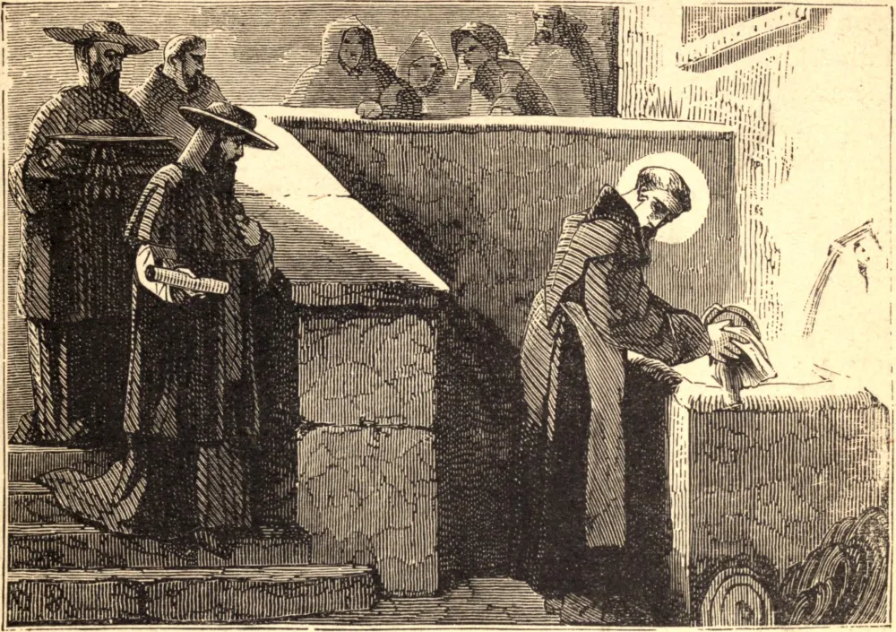

# 14 de julho — SÃO BOAVENTURA

A santidade e a erudição elevaram Boaventura às mais altas honras da Igreja, e desde criança foi o companheiro dos Santos. Contudo, em seu coração foi sempre o pobre frade franciscano, e praticou e ensinou a humildade e a mortificação. São Francisco deu-lhe seu nome; pois, tendo-o curado milagrosamente de uma enfermidade mortal, exclamou profeticamente acerca da criança: "*O bona ventura!*" — boa ventura. É conhecido também como o "Doutor Seráfico", pelo fervor do amor divino que respira em seus escritos. Foi amigo de São Tomás de Aquino, que um dia lhe perguntou de onde extraía sua grande erudição. Ele respondeu apontando para seu crucifixo. Em outra ocasião, São Tomás encontrou-o em êxtase enquanto escrevia a vida de São Francisco, e exclamou: "Deixemos um Santo escrever sobre um Santo." Receberam juntos o barrete de Doutor.

Foi hóspede e conselheiro de São Luís, e o diretor de Santa Isabel, irmã do rei. Aos trinta e cinco anos foi feito geral de sua Ordem; e somente escapou de outra dignidade, o Arcebispado de York, à força de lágrimas e súplicas. Gregório X o nomeou Cardeal Bispo de Albano. Quando o Santo soube da resolução do Papa de criá-lo Cardeal, fugiu silenciosamente da Itália. Mas Gregório enviou-lhe uma intimação para regressar a Roma. No caminho, deteve-se para descansar num convento de sua Ordem perto de Florença; e ali dois mensageiros papais, enviados ao seu encontro com o chapéu de Cardeal, encontraram-no lavando a louça. O Santo pediu-lhes que pendurassem o chapéu num arbusto próximo, e dessem um passeio no jardim até que ele terminasse o que estava fazendo. Então, tomando o chapéu com não fingida tristeza, juntou-se aos mensageiros, e prestou-lhes o respeito devido à sua dignidade.

Sentou-se à direita do Pontífice, e falou primeiro no Concílio de Lião. Sua piedade e eloquência ganharam os gregos para a união católica, e então suas forças faltaram. Morreu enquanto o Concílio estava reunido, e foi sepultado pelos bispos ali congregados, no ano do Senhor de 1274.

**Reflexão**—"O temor de Deus", diz São Boaventura, "proíbe ao homem entregar seu coração às coisas transitórias, que são as verdadeiras sementes do pecado."
