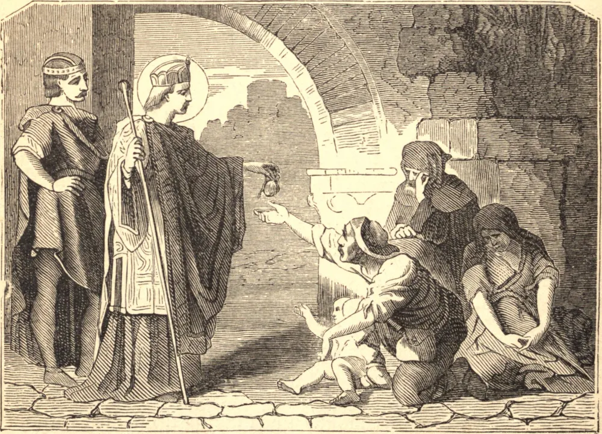

# 15 de julho — SANTO HENRIQUE, Imperador

Henrique, Duque da Baviera, viu numa visão seu guardião, São Wolfgang, apontando para as palavras "depois de seis." Isto moveu-o a preparar-se para a morte, e por seis anos continuou a vigiar e orar, quando, ao fim do sexto ano, encontrou o aviso verificado em sua eleição como imperador. Assim formado no temor de Deus, ascendeu ao trono com um único pensamento — reinar para Sua maior glória.

Os pagãos eslavos então despojavam o império. Henrique atacou-os com uma pequena força; mas viram-se anjos e Santos conduzindo suas tropas, e os infiéis fugiram em desespero. A Polônia e a Boêmia, a Morávia e a Borgonha foram por sua vez anexadas a seu reino, a Panônia e a Hungria ganhas para a Igreja. Com a Fé assegurada na Alemanha, Henrique passou à Itália, expulsou o Antipapa Gregório, trouxe Bento VIII de volta a Roma, e foi coroado em São Pedro por aquele Pontífice, em 1014.

Era costume de Henrique, ao chegar a qualquer cidade, passar sua primeira noite em vigília em alguma igreja dedicada a Nossa Senhora. Enquanto orava assim em Santa Maria Maior, na primeira noite de sua chegada a Roma, "viu o Soberano e Eterno Sacerdote Cristo Jesus" entrar para dizer a Missa. São Lourenço e São Vicente assistiam como diácono e subdiácono. Santos inumeráveis enchiam a igreja, e os anjos cantavam no coro. Após o Evangelho, um anjo foi enviado por Nossa Senhora a dar a Henrique o livro para beijar. Tocando-o levemente na coxa, como o anjo fez a Jacó, disse: "Recebe este sinal do amor de Deus por tua castidade e justiça;" e desde aquele tempo o imperador foi sempre coxo.

Como o santo Davi, Henrique empregou os frutos de suas conquistas no serviço do templo. As florestas e minas do império, o melhor que seu tesouro podia produzir, eram consagradas ao santuário. Catedrais majestosas, mosteiros nobres, igrejas inumeráveis iluminaram e santificaram as terras outrora infiéis. Em 1022, Henrique jazia em seu leito de morte. Devolveu a seus pais sua esposa, Santa Cunegundes, "ainda virgem, como virgem a havia recebido de Cristo", e entregou a Deus sua própria alma pura.

**Reflexão**—Santo Henrique privou-se de muitas coisas para enriquecer a casa de Deus. Nós nos vestimos de púrpura e linho fino, e deixamos Jesus na pobreza e no abandono.
