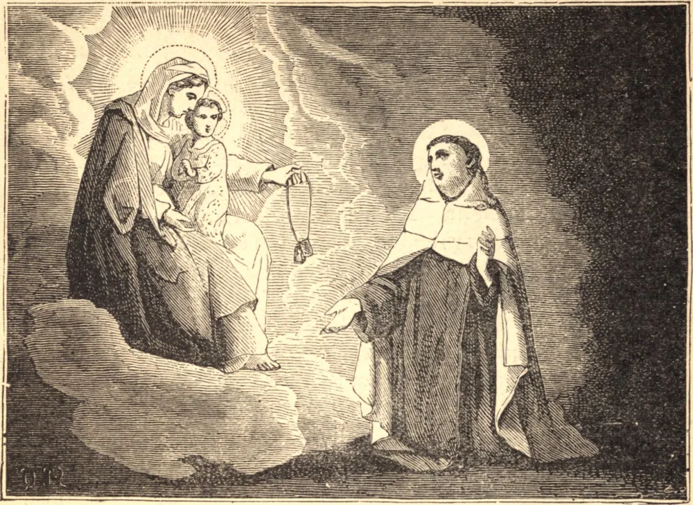

# 16 de julho — SÃO SIMÃO STOCK

Simão nasceu no condado de Kent, Inglaterra, e deixou seu lar quando tinha apenas doze anos de idade, para viver como eremita no tronco oco de uma árvore, donde ficou conhecido como Simão do Tronco. Aqui passou vinte anos em penitência e oração, e aprendeu de Nossa Senhora que havia de unir-se a uma Ordem então desconhecida na Inglaterra. Esperou com paciência até que vieram os Frades Brancos, e então entrou na Ordem de Nossa Senhora do Monte Carmelo. Sua grande santidade moveu seus irmãos no capítulo geral realizado em Aylesford, perto de Rochester, em 1245, a escolhê-lo prior-geral da Ordem.

Nas muitas perseguições levantadas contra os novos religiosos, Simão recorria com filial confiança à Santíssima Mãe de Deus. Enquanto se ajoelhava em oração no convento dos Frades Brancos em Cambridge, em 16 de julho de 1251, ela apareceu diante dele e presenteou-o com o escapulário, em garantia de sua proteção. A devoção ao bendito hábito espalhou-se rapidamente por todo o mundo cristão. Papa após Papa o enriqueceram com indulgências, e milagres inumeráveis selaram a sua eficácia. O primeiro deles operou-se em Winchester sobre um homem que morria em desespero, o qual de imediato pediu os Sacramentos, quando São Simão Stock pôs sobre ele o escapulário.

No ano de 1636, o senhor de Guge, corneta de um regimento de cavalaria, foi mortalmente ferido no combate de Tobin, tendo uma bala se alojado perto de seu coração. Encontrava-se então em estado de pecado grave, mas restou-lhe tempo para fazer sua confissão, e com as próprias mãos escreveu seu último testamento. Feito isto, o cirurgião sondou-lhe a ferida, e verificou-se que a bala havia cravado seu escapulário em seu coração. Ao ser este retirado, ele logo expirou, fazendo profundos atos de gratidão à Santíssima Virgem, que havia prolongado sua vida miraculosamente, e assim o preservara da morte eterna. São Simão Stock morreu em Bordéus em 1265.

**Reflexão**—Para gozar dos privilégios do escapulário, basta que seja recebido legitimamente e usado com devoção. Como, então, pode alguém deixar de aproveitar uma devoção tão fácil, tão simples e tão maravilhosamente abençoada? "O que vencer será assim vestido de vestes brancas, e não apagarei seu nome do livro da vida, e confessarei seu nome diante de Meu Pai e diante de Seus anjos" (Apoc. iii. 5).
