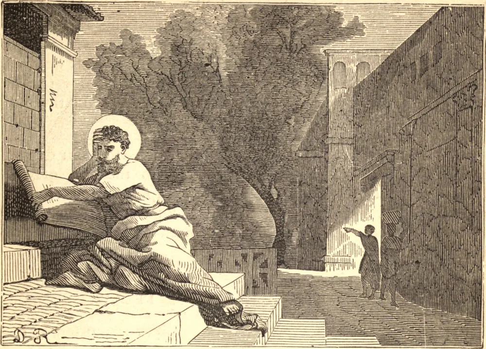

# 17 de julho — SANTO ALEIXO

Santo Aleixo era o único filho de pais preeminentes entre os nobres romanos por virtude, nascimento e riqueza. Na noite de suas núpcias, por especial inspiração de Deus, deixou Roma secretamente, e, viajando para Edessa, no extremo Oriente, distribuiu tudo o que havia trazido consigo, contentando-se dali em diante a viver de esmolas à porta da igreja de Nossa Senhora naquela cidade.

Sucedeu que os servos de Santo Aleixo, que seu pai enviara em busca dele, chegaram a Edessa, e, vendo-o entre os pobres à porta da igreja de Nossa Senhora, deram-lhe uma esmola, sem reconhecê-lo. Diante disto, o homem de Deus, regozijando-se, disse: "Eu Te agradeço, ó Senhor, que me chamaste e concedeste que eu recebesse, em nome do Teu nome, uma esmola de meus próprios escravos. Digna-Te de cumprir em mim a obra que começaste."

Após dezessete anos, quando sua santidade foi miraculosamente manifestada pela imagem da Santíssima Virgem, buscou novamente a obscuridade pela fuga. A caminho de Tarso, ventos contrários impeliram seu navio a Roma. Ali ninguém reconheceu, no pálido e esfarrapado mendigo, o herdeiro da mais nobre casa de Roma; nem mesmo seus pesarosos pais, que em vão haviam enviado pelo mundo inteiro em busca dele. Da caridade de seu pai mendigou um canto pobre de seu palácio como abrigo, e as sobras de sua mesa como alimento. Assim passou dezessete anos, suportando com paciência a zombaria e os maus-tratos de seus próprios escravos, e testemunhando diariamente o inconsolável pesar de sua esposa e de seus pais. Por fim, quando a morte pôs termo a este cruel martírio, souberam tarde demais, por um escrito de sua própria mão, quem era aquele que haviam abrigado sem o saber. Deus deu testemunho da santidade de Seu servo por muitos milagres. Morreu no início do século quinto.

**Reflexão**—Devemos estar sempre prontos a sacrificar nossas mais caras e melhores afeições naturais em obediência ao chamado de nosso Pai celestial. "A ninguém chameis vosso pai sobre a terra, porque um só é vosso Pai, que está nos céus" (Mt. xxiii. 9). Nosso Senhor ensinou-nos isto não apenas por palavras, mas por Seu próprio exemplo e pelo de Seus Santos.
