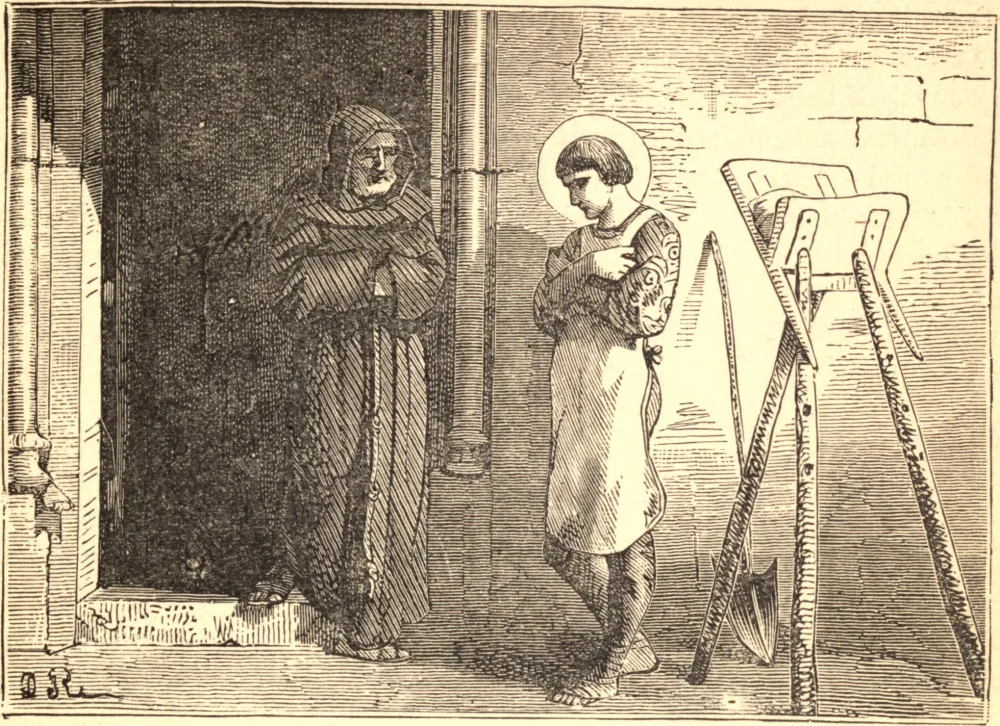

# 18 de julho — SÃO CAMILO DE LÉLIS

Os primeiros anos de Camilo não deram sinal algum de santidade. Aos dezenove anos tomou serviço com seu pai, um nobre italiano, contra os turcos, e após quatro anos de duras campanhas viu-se, por seu temperamento violento, hábitos imprudentes e inveterada paixão pelo jogo, um soldado dispensado, e em circunstâncias tão estreitas que foi obrigado a trabalhar como operário num convento capuchinho que então se construía. Algumas palavras de um frade capuchinho operaram sua conversão, e resolveu tornar-se religioso. Três vezes entrou no noviciado capuchinho, mas a cada vez uma ferida obstinada em sua perna o forçou a sair. Dirigiu-se a Roma para tratamento médico, e ali tomou São Filipe como seu confessor, e entrou no hospital de São Tiago, do qual se tornou com o tempo o superintendente. O descuido dos capelães e enfermeiros assalariados para com os pacientes que sofriam inspirou-lhe então o pensamento de fundar uma congregação para servir às suas necessidades. Com este fim foi ordenado sacerdote, e em 1586 sua comunidade dos Servos dos Enfermos foi confirmada pelo Papa. Sua utilidade logo se fez sentir, não somente nos hospitais, mas nas casas particulares. Chamado a toda hora do dia e da noite, a dedicação de Camilo jamais esfriou. Com ternura de mulher atendia às necessidades de seus pacientes. Chorava com eles, consolava-os e orava com eles. Conhecia miraculosamente o estado de suas almas; e São Filipe viu anjos sussurrando a dois Servos dos Enfermos que consolavam uma pessoa moribunda. Um dia um homem enfermo disse ao Santo: "Padre, posso suplicar-vos que arrumeis a minha cama? está muito dura." Camilo respondeu: "Deus vos perdoe, irmão! Vós me suplicais! Não sabeis ainda que sois vós quem deveis comandar-me, pois sou vosso servo e escravo." "Prouvera a Deus", costumava clamar, "que na hora de minha morte um suspiro ou uma bênção destas pobres criaturas caísse sobre mim!" Sua oração foi ouvida. Foram-lhe concedidas em sua última hora as mesmas consolações que tantas vezes havia procurado para os outros. No ano de 1614 morreu com o pleno uso de suas faculdades, após duas semanas de santa preparação, enquanto o sacerdote recitava as palavras do ritual: "Que Jesus Cristo apareça a ti com semblante manso e alegre!"

## Reflexão

São Camilo venerava os enfermos como imagens vivas de Cristo, e, servindo-os neste espírito, fez penitência pelos pecados de sua juventude, levou uma vida preciosa em mérito, e de soldado violento e briguento tornou-se um Santo manso e terno.
