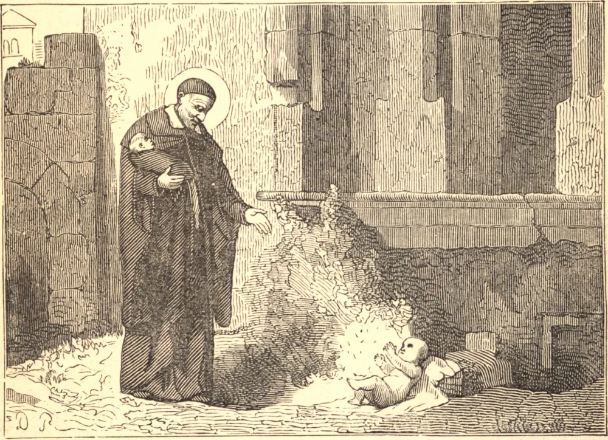

# 19 de julho — SÃO VICENTE DE PAULO

São Vicente nasceu em 1576. Em anos posteriores, quando conselheiro da rainha e oráculo da Igreja na França, gostava de recontar como, em sua juventude, havia guardado os porcos de seu pai. Pouco depois de sua ordenação foi capturado por corsários, e levado à Berbéria. Converteu seu mestre renegado, e fugiu com ele para a França. Nomeado capelão-geral das galés da França, sua terna caridade levou a esperança àquelas prisões onde até então reinara o desespero. Uma mãe pranteava seu filho aprisionado. Vicente vestiu suas correntes e tomou seu lugar ao remo, e o devolveu à sua mãe. Sua caridade abraçava os pobres, jovens e velhos, as províncias desoladas pela guerra civil, os cristãos escravizados pelo infiel. O homem pobre, ignorante e degradado, era para ele a imagem d'Aquele que se tornou como "um leproso e nenhum homem." "Vira a medalha", dizia ele, "e verás então Jesus Cristo." Percorria as ruas de Paris à noite, buscando as crianças que ali eram deixadas para morrer. Certa vez ladrões precipitaram-se sobre ele, pensando que carregava um tesouro, mas quando abriu seu manto, reconheceram-no a ele e ao seu fardo, e caíram a seus pés. Não foi São Vicente somente o salvador dos pobres, mas também dos ricos, pois ensinou-os a fazer obras de misericórdia. Quando a obra dos enjeitados corria perigo de fracassar por falta de fundos, reuniu as damas da Associação de Caridade. Ordenou que suas filhas mais fervorosas estivessem presentes para dar o estímulo às demais. Então disse: "A compaixão e a caridade vos fizeram adotar estas pequenas criaturas como vossos filhos. Fostes suas mães segundo a graça, quando suas próprias mães as abandonaram. Cessai de ser suas mães, para que vos torneis suas juízas; sua vida e sua morte estão em vossas mãos. Recolherei agora vossos votos: é tempo de pronunciar a sentença." As lágrimas da assembleia foram sua única resposta, e a obra prosseguiu. A Sociedade de São Vicente, os Padres da Missão, e 25.000 Irmãs de Caridade ainda confortam os aflitos com a caridade de São Vicente de Paulo. Morreu em 1660.

## Reflexão

A maioria das pessoas que professam a piedade pede conselho aos diretores acerca de suas orações e exercícios espirituais. Poucas indagam se não estão em perigo de condenação por negligenciar as obras de caridade.
