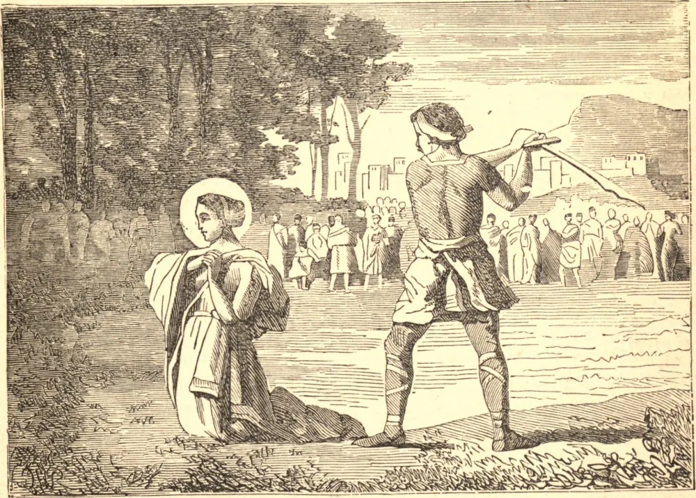

# 20 de julho — SANTA MARGARIDA, Virgem e Mártir

Segundo os antigos Martirológios, Santa Margarida sofreu em Antioquia da Pisídia, na última perseguição geral. Diz-se que foi instruída na Fé por uma ama cristã, que foi perseguida por seu próprio pai, um sacerdote pagão, e que, após muitos tormentos, gloriosamente consumou seu martírio pela espada. Do Oriente, sua veneração propagou-se em altíssimo grau na Inglaterra, na França e na Alemanha, no século onze, durante as guerras santas. Seu corpo é agora conservado em Monte-Fiascone, na Toscana.
